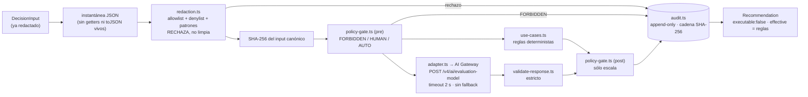

# Capa de decisión Jev — Fase 0 (shadow)

> Estado: **implementado · probado localmente y contra el gateway · NO desplegado**.
> Veredicto vigente: `JEV_DECISION_LAYER_BLOCKED` — la tubería funciona, pero la corrida completa
> todavía tiene errores transitorios del proveedor y la calidad medida no permite adopción. Ver §6.
> Fecha: 2026-09-25. Contrato: `jev-decision/0.1.0`. Modelo: `typesafe-ai/jev` (único).
> Plan de origen: `~/Documents/Fullsite/auditorias/observability-stack-2026-09-25/JEV-SHADOW-EVALUATION-PLAN.md`.

## 1. Qué es y qué no es

Una capa **reutilizable y aislada** (`dashboard-app/src/lib/jev/`) que recibe un estado
estructurado ya redactado, corre reglas deterministas locales, le pide a Jev una opinión
tipada y devuelve una **recomendación no ejecutable** con su autoridad y su rastro de auditoría.

- **No ejecuta nada.** `Recommendation.executable` es el literal `false`.
- **No hay modo autónomo.** `JevMode = 'shadow'` es el único valor del tipo.
- **Las reglas mandan siempre.** En shadow, `effective` = decisión de reglas, y `authority` y
  `policy_applied` dependen sólo de la entrada y de las reglas: la salida es idéntica con Jev de
  acuerdo, en desacuerdo, caído o apagado (prueba "autoridad y política son deterministas").
  Lo que Jev opina va en `jev` y `agreement`; lo que habría escalado, en `shadow_notes`.
- **No la importa nadie.** Ni POS, ni KDS, ni rutas API. Una prueba guardián lo impone
  (`isolation-compare.test.ts`). POS y KDS no cambian ni un byte.

## 2. Flujo



## 3. Módulos

| Archivo | Responsabilidad |
|---|---|
| `contract.ts` | Tipos versionados, modelo único, URL, precio, dominios prohibidos |
| `use-cases.ts` | Por caso: esquema allowlist, etiquetas cerradas, reglas, preguntas Jev |
| `redaction.ts` | Política de redacción; `checkInput`, `canonicalJson`, `hashInput` |
| `policy-gate.ts` | Autoridad previa (FORBIDDEN corta todo) y escalamiento posterior |
| `adapter.ts` | Protocolo del gateway sin AI SDK; timeout; retry acotado sólo para 429; errores sanitizados |
| `validate-response.ts` | Invariantes de la respuesta v4 (forma, conjunto, sumas, argmax, rangos) |
| `engine.ts` | Orquestación sobre una instantánea de la entrada; no lanza; audita todo, incluidos rechazos |
| `audit.ts` | Sinks memoria/archivo con ancla `.head`; `verifyAuditChain` |
| `compare.ts` | Jev vs reglas vs oráculo: precisión, Brier, acuerdo, latencia, costo, veredicto |
| `fixtures/synthetic-cases.ts` | 43 casos con oráculo + 14 entradas hostiles; 2 tenants sintéticos |
| `eval/run.eval.ts` | Corrida filtrable de comparación que escribe el reporte TXT/JSON |
| `eval/corpus-plan.ts` | Plan estratificado y honesto para llegar a 2,000 casos independientes |

### Protocolo (verificado en código fuente, no en docs)

La documentación pública de Vercel no describe el endpoint de evaluación. Se tomó del código de
`@ai-sdk/gateway@4.0.92` (`gateway-evaluation-model.ts`) y `@ai-sdk/provider@4.0.18`
(`EvaluationModelV4*`), descargados con `npm pack` sólo para leer:

- `POST https://ai-gateway.vercel.sh/v4/ai/evaluation-model`
- Headers: `ai-model-id`, `ai-evaluation-model-specification-version: 4`,
  `ai-gateway-protocol-version: 0.0.1`, `ai-gateway-auth-method: api-key`, `Authorization: Bearer …`
- Cuerpo: `{ state, questions }`. Preguntas `choice` / `score` / `boolean`.
- Respuesta: `{ answers, model?, rounding?, usage?, warnings?, providerMetadata? }`. Si el gateway
  informa `model`, debe ser exactamente `typesafe-ai/jev`; otro id falla cerrado.

No se agregó `ai` como dependencia: su API de evaluación es `experimental_*` ("may change in
patch releases") y metería peso en un bundle que el POS comparte.

### Mapeo a la decisión tipada

| Campo | Pregunta a Jev | Derivación |
|---|---|---|
| `label` | `decision` (choice; criterios = etiquetas cerradas del caso) | `choice` |
| `confidence` | — | `probabilities[choice]`; si no hay distribución → 0 (escala a humano) |
| `risk` | `risk` (score, 4 niveles) | `round(score)` → low/medium/high/critical |
| `needs_human_review` | `needs_human_review` (boolean) | `probability ≥ 0.5` |

## 4. Casos de uso y autoridad

| Caso | Autoridad base | Etiquetas |
|---|---|---|
| `alert_priority` | AUTO | P0 · P1 · P2 · P3 |
| `incident_classification` | AUTO | regression · stale_test · contract_changed · configuration · environment · field_only (§5 del protocolo) |
| `agent_routing` | AUTO | frontend · offline_core · pos_kds · integrations · data · docs · security_review · human_owner |
| `task_done` | **HUMAN_REQUIRED** siempre (cerrar trabajo es efecto operativo) | done · not_done · insufficient_evidence (§10) |
| `contradiction_check` | AUTO | consistent · contradiction · insufficient_evidence |

Reglas de autoridad (en orden):

1. Algún `effect_domain` ∈ {money, identity, security, deploy, migration, production} → **FORBIDDEN**.
   No se consultan reglas ni Jev. Salida sin decisión.
2. `commercial` u `operational` → **HUMAN_REQUIRED**.
3. Sólo `none` y caso AUTO → **AUTO**.
4. Piso por contenido: `incident_classification` con `component: auth` o `symptom: missing_env`,
   y `agent_routing` con `task_kind: security|infra` → nunca AUTO (`human:sensitive_state:*`).
   FORBIDDEN depende de lo que declara el llamador; el piso evita que un estado sensible salga AUTO
   por una declaración descuidada.
5. Después, la autoridad sólo sube, y sólo por las reglas: confianza < 0.7, bandera de revisión,
   riesgo crítico, falta de decisión o falla de auditoría → HUMAN_REQUIRED. Jev no la mueve.

Entradas rechazadas: si declararon un dominio prohibido salen FORBIDDEN; si son ilegibles
(circulares, getters que lanzan) salen FORBIDDEN (`forbidden:unreadable_input`); el resto,
HUMAN_REQUIRED. `effect_domains` vacío se rechaza (falla cerrado).

Decisión registrada: `task_done` con `claimed_status: implemented` y pruebas fallidas sale `done`,
porque "implementado" sólo afirma que existe código (§10). Es discutible y es HUMAN_REQUIRED.

## 5. Operación

- Interruptor: `JEV_SHADOW_ENABLED=1`. Por defecto **apagado** → `jev_disabled`, sin red.
- Credencial: `AI_GATEWAY_API_KEY` leída en el momento de la llamada. Nunca se registra.
- Timeout: 2 s por defecto y configurable en evaluación con `JEV_TIMEOUT_MS` (500–30,000 ms).
- `HTTP 429`: hasta 2 reintentos adicionales, respetando `Retry-After` numérico o usando espera
  exponencial acotada. Ningún otro estado HTTP se reintenta automáticamente.
- `HTTP 503`: se clasifica explícitamente como `service_unavailable_error`; no se oculta mediante
  reintentos para que el gate mida la disponibilidad real del proveedor.
- Ritmo del runner: 5 req/s por defecto; configurable con `JEV_MIN_INTERVAL_MS` (200–10,000 ms).
- Filtro de diagnóstico: `JEV_USE_CASE_FILTER=task_done,contradiction_check` (lista cerrada).
- Gasto: el runner corta en USD 1.00.

```bash
cd dashboard-app && npx vitest run src/__tests__/jev
```

```bash
cd dashboard-app && npx vitest run --config vitest.jev-eval.config.ts
```

Corrida viva (sólo fixtures sintéticos; la llave sale del Keychain vía `~/.zshrc`):

```bash
cd dashboard-app && zsh -ic 'JEV_SHADOW_ENABLED=1 JEV_LIVE=1 npx vitest run --config vitest.jev-eval.config.ts'
```

Diagnóstico acotado a 1 req/s y timeout de 5 s:

```bash
cd dashboard-app && zsh -ic 'JEV_SHADOW_ENABLED=1 JEV_LIVE=1 JEV_MIN_INTERVAL_MS=1000 JEV_TIMEOUT_MS=5000 JEV_USE_CASE_FILTER=task_done,contradiction_check npx vitest run --config vitest.jev-eval.config.ts'
```

## 6. Estado vivo del 2026-09-25

La verificación de cuenta ya fue resuelta y el gateway responde. También se corrigió la validación
del campo raíz `model`, manteniendo la restricción al único modelo permitido. La batería local pasa
160/160; TypeScript y el lint del alcance pasan.

Diagnóstico aislado de `task_done` + `contradiction_check`, a 1 req/s y timeout 5 s:

- 13/13 respuestas válidas; 0 errores 429 y 0 errores 503.
- p50 1,005 ms; p95/máximo 1,147 ms; costo estimado USD 0.00031046.
- Calidad: `task_done` 2/7 (28.6 %) y `contradiction_check` 4/6 (66.7 %): ambos **REJECT**.
- 14/14 entradas hostiles bloqueadas antes de red y cadena de auditoría íntegra.

Repetición completa de 43 casos con los mismos límites conservadores:

- 34/43 respuestas válidas y 9 `HTTP 503 service_unavailable_error`; 0 errores 429.
- p50 1,008 ms; p95 1,210 ms; máximo 1,277 ms; costo estimado USD 0.00081425.
- Los 503 se concentraron en 1 caso de `agent_routing`, 6 de `task_done` y 2 de
  `contradiction_check`. El diagnóstico aislado de esas familias había respondido 13/13, por lo que
  no es una incompatibilidad determinista del contrato: es disponibilidad/capacidad transitoria.
- `alert_priority` y `incident_classification` tuvieron cobertura completa pero precisión Jev de
  50 % y 70 % respectivamente: ambos **REJECT**. Los demás casos quedan **BLOCKED** por respuestas
  faltantes, sin imputar resultados.
- 14/14 entradas hostiles bloqueadas antes de red; 57 registros con cadena íntegra.

Evidencia viva:

- `~/Documents/Codex/2026-09-19/docu/outputs/jev-live-20260925-160126-isolated/`
- `~/Documents/Codex/2026-09-19/docu/outputs/jev-live-20260925-160221-full43/`

El veredicto continúa **BLOCKED**: la tubería está operativa, pero la disponibilidad en la corrida
integral y la calidad de los casos respondidos no autorizan integrar Jev a ninguna ruta crítica.
Jev permanece exclusivamente en shadow; `effective` sigue siendo la decisión de reglas y
`executable` continúa siendo `false`.

## 7. Plan de evaluación hasta 2,000 casos

El objetivo se fija en 2,000 casos con oráculo independiente: 400 por cada uno de los cinco casos
de uso. Los 43 fixtures actuales validan la tubería, pero fueron escritos junto con las reglas y no
se cuentan como evidencia independiente suficiente. Faltan 1,957 casos etiquetados de forma
independiente: 388 de `alert_priority`, 390 de `incident_classification`, 392 de `agent_routing`,
393 de `task_done` y 394 de `contradiction_check`.

La expansión se hará en lotes pequeños, con límites de costo y disponibilidad, sin reutilizar los
mismos fixtures como evidencia nueva. Llegar a 2,000 no cambia la autoridad: sólo permite medir
calidad. Cualquier adopción futura exige una decisión separada y revisión humana.

El plan estructurado está en [EVALUATION-2000-PLAN.json](EVALUATION-2000-PLAN.json).

Ver [THREAT-MODEL.md](THREAT-MODEL.md) y [ROLLBACK.md](ROLLBACK.md).
