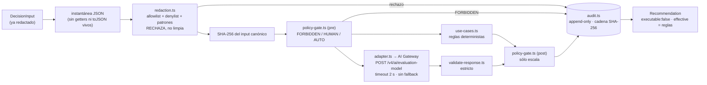

# Capa de decisión Jev — Fase 0 (shadow)

> Estado: **implementado · probado localmente · NO desplegado**. Veredicto de la fase:
> `JEV_DECISION_LAYER_BLOCKED` — ver [reports/](reports/) y §6.
> Fecha: 2026-09-25. Contrato: `jev-decision/0.1.0`. Modelo: `typesafe-ai/jev` (único).
> Plan de origen: `~/Documents/Fullsite/auditorias/observability-stack-2026-09-25/JEV-SHADOW-EVALUATION-PLAN.md`.

## 1. Qué es y qué no es

Una capa **reutilizable y aislada** (`dashboard-app/src/lib/jev/`) que recibe un estado
estructurado ya redactado, corre reglas deterministas locales, le pide a Jev una opinión
tipada y devuelve una **recomendación no ejecutable** con su autoridad y su rastro de auditoría.

- **No ejecuta nada.** `Recommendation.executable` es el literal `false`.
- **No hay modo autónomo.** `JevMode = 'shadow'` es el único valor del tipo.
- **Las reglas mandan siempre.** En shadow, `effective` = decisión de reglas, y `authority` y
  `policy_applied` dependen sólo de la entrada y de las reglas: la salida es idéntica con Jev de
  acuerdo, en desacuerdo, caído o apagado (prueba "autoridad y política son deterministas").
  Lo que Jev opina va en `jev` y `agreement`; lo que habría escalado, en `shadow_notes`.
- **No la importa nadie.** Ni POS, ni KDS, ni rutas API. Una prueba guardián lo impone
  (`isolation-compare.test.ts`). POS y KDS no cambian ni un byte.

## 2. Flujo



## 3. Módulos

| Archivo | Responsabilidad |
|---|---|
| `contract.ts` | Tipos versionados, modelo único, URL, precio, dominios prohibidos |
| `use-cases.ts` | Por caso: esquema allowlist, etiquetas cerradas, reglas, preguntas Jev |
| `redaction.ts` | Política de redacción; `checkInput`, `canonicalJson`, `hashInput` |
| `policy-gate.ts` | Autoridad previa (FORBIDDEN corta todo) y escalamiento posterior |
| `adapter.ts` | Protocolo del gateway sin AI SDK; timeout; errores sanitizados |
| `validate-response.ts` | Invariantes de la respuesta v4 (forma, conjunto, sumas, argmax, rangos) |
| `engine.ts` | Orquestación sobre una instantánea de la entrada; no lanza; audita todo, incluidos rechazos |
| `audit.ts` | Sinks memoria/archivo con ancla `.head`; `verifyAuditChain` |
| `compare.ts` | Jev vs reglas vs oráculo: precisión, Brier, acuerdo, latencia, costo, veredicto |
| `fixtures/synthetic-cases.ts` | 43 casos con oráculo + 14 entradas hostiles; 2 tenants sintéticos |
| `eval/run.eval.ts` | Corrida de comparación que escribe el reporte TXT/JSON |

### Protocolo (verificado en código fuente, no en docs)

La documentación pública de Vercel no describe el endpoint de evaluación. Se tomó del código de
`@ai-sdk/gateway@4.0.92` (`gateway-evaluation-model.ts`) y `@ai-sdk/provider@4.0.18`
(`EvaluationModelV4*`), descargados con `npm pack` sólo para leer:

- `POST https://ai-gateway.vercel.sh/v4/ai/evaluation-model`
- Headers: `ai-model-id`, `ai-evaluation-model-specification-version: 4`,
  `ai-gateway-protocol-version: 0.0.1`, `ai-gateway-auth-method: api-key`, `Authorization: Bearer …`
- Cuerpo: `{ state, questions }`. Preguntas `choice` / `score` / `boolean`.
- Respuesta: `{ answers, rounding?, usage?, warnings?, providerMetadata? }`.

No se agregó `ai` como dependencia: su API de evaluación es `experimental_*` ("may change in
patch releases") y metería peso en un bundle que el POS comparte.

### Mapeo a la decisión tipada

| Campo | Pregunta a Jev | Derivación |
|---|---|---|
| `label` | `decision` (choice; criterios = etiquetas cerradas del caso) | `choice` |
| `confidence` | — | `probabilities[choice]`; si no hay distribución → 0 (escala a humano) |
| `risk` | `risk` (score, 4 niveles) | `round(score)` → low/medium/high/critical |
| `needs_human_review` | `needs_human_review` (boolean) | `probability ≥ 0.5` |

## 4. Casos de uso y autoridad

| Caso | Autoridad base | Etiquetas |
|---|---|---|
| `alert_priority` | AUTO | P0 · P1 · P2 · P3 |
| `incident_classification` | AUTO | regression · stale_test · contract_changed · configuration · environment · field_only (§5 del protocolo) |
| `agent_routing` | AUTO | frontend · offline_core · pos_kds · integrations · data · docs · security_review · human_owner |
| `task_done` | **HUMAN_REQUIRED** siempre (cerrar trabajo es efecto operativo) | done · not_done · insufficient_evidence (§10) |
| `contradiction_check` | AUTO | consistent · contradiction · insufficient_evidence |

Reglas de autoridad (en orden):

1. Algún `effect_domain` ∈ {money, identity, security, deploy, migration, production} → **FORBIDDEN**.
   No se consultan reglas ni Jev. Salida sin decisión.
2. `commercial` u `operational` → **HUMAN_REQUIRED**.
3. Sólo `none` y caso AUTO → **AUTO**.
4. Piso por contenido: `incident_classification` con `component: auth` o `symptom: missing_env`,
   y `agent_routing` con `task_kind: security|infra` → nunca AUTO (`human:sensitive_state:*`).
   FORBIDDEN depende de lo que declara el llamador; el piso evita que un estado sensible salga AUTO
   por una declaración descuidada.
5. Después, la autoridad sólo sube, y sólo por las reglas: confianza < 0.7, bandera de revisión,
   riesgo crítico, falta de decisión o falla de auditoría → HUMAN_REQUIRED. Jev no la mueve.

Entradas rechazadas: si declararon un dominio prohibido salen FORBIDDEN; si son ilegibles
(circulares, getters que lanzan) salen FORBIDDEN (`forbidden:unreadable_input`); el resto,
HUMAN_REQUIRED. `effect_domains` vacío se rechaza (falla cerrado).

Decisión registrada: `task_done` con `claimed_status: implemented` y pruebas fallidas sale `done`,
porque "implementado" sólo afirma que existe código (§10). Es discutible y es HUMAN_REQUIRED.

## 5. Operación

- Interruptor: `JEV_SHADOW_ENABLED=1`. Por defecto **apagado** → `jev_disabled`, sin red.
- Credencial: `AI_GATEWAY_API_KEY` leída en el momento de la llamada. Nunca se registra.
- Timeout: 2 s (plan §5). Gasto: el runner corta en USD 1.00 y 5 req/s.

```bash
cd dashboard-app && npx vitest run src/__tests__/jev
```

```bash
cd dashboard-app && npx vitest run --config vitest.jev-eval.config.ts
```

Corrida viva (sólo fixtures sintéticos; la llave sale del Keychain vía `~/.zshrc`):

```bash
cd dashboard-app && zsh -ic 'JEV_SHADOW_ENABLED=1 JEV_LIVE=1 npx vitest run --config vitest.jev-eval.config.ts'
```

## 6. Por qué la fase está BLOCKED

El 2026-09-25 una llamada real con estado sintético devolvió
`HTTP 403 customer_verification_required` ("AI Gateway requires a valid credit card on file").
La credencial existe y autentica; la cuenta no tiene método de pago, así que el gateway no
sirve ninguna petición. Todo lo que no depende de esa llamada está construido y probado; la
comparación Jev vs reglas queda **sin datos de Jev** y el comparador lo reporta como
`BLOCKED` en lugar de inventar una precisión.

Corrida viva final (código de este commit, `reports/jev-shadow-2026-09-25T20-04-54-615Z.*`):
43 llamadas de red → 41 `HTTP 403 customer_verification_required` y 2 `timeout` (> 2 s, con la
suite completa corriendo en paralelo); 0 respuestas de Jev; costo USD 0; 14 entradas hostiles
bloqueadas sin tocar la red; 57 registros de auditoría con cadena íntegra.

Para desbloquear: Daniel agrega una tarjeta en Vercel → AI Gateway, y se corre el comando
de corrida viva. No hay que cambiar código. Si pasa, el siguiente paso del plan (§6) es
ampliar a 2,000 casos antes de emitir cualquier veredicto PASS/REJECT por caso de uso.

Ver [THREAT-MODEL.md](THREAT-MODEL.md) y [ROLLBACK.md](ROLLBACK.md).
