# Galería de pantallas — POS · KDS · Dashboard, lado a lado

**Fecha:** 2026-08-27 · Imágenes descargadas de fuentes oficiales (CDNs de cada empresa, demo Arcade de Parrot, video-tutoriales públicos de SR) a `assets/`. Cada biblia tiene el detalle; esto es para VER y comparar de un vistazo. Huecos marcados — se cierran con las demos del [`GUION-DEMOS-COMPETENCIA.md`](GUION-DEMOS-COMPETENCIA.md).

---

## 1. El POS — la pantalla de venta

### Toast — Quick Order (mostrador) y Table Order (mesa, oscuro)

**Qué mirar:** jerarquía Menus→Groups→Items siempre visible (cero taps de profundidad) · **contador de stock pre-86 en el tile** (15, 14...) · dark contextual para comedor con el MISMO layout · Pay azul (identidad ≠ interacción, ver TOAST-BIBLE §15).

### Parrot — Mesas → Orden → Cobro (demo oficial)

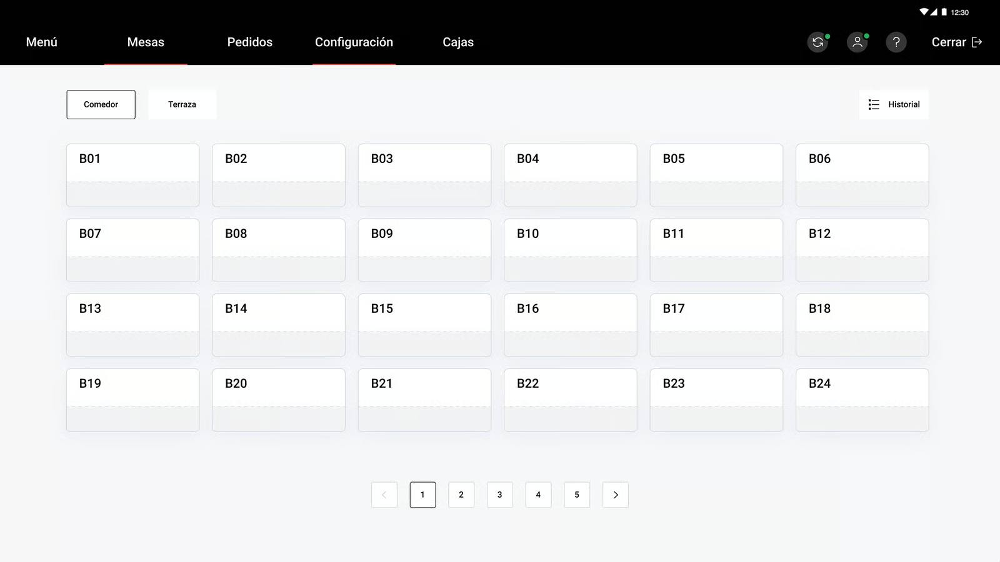

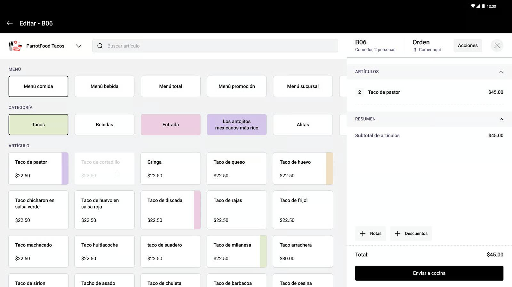

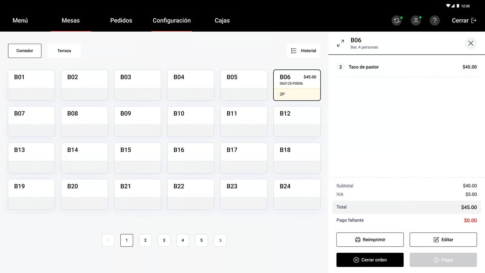

**Qué mirar:** mesas en grid paginado SIN plano (5 páginas — con salón grande se navega a clics) · selector de MARCA arriba de la orden (multimarca/dark kitchen real) · 3 niveles de filtro (menú→categoría→artículo con franjas de color) · **IVA desglosado en el ticket** ($40+$5) · panel de cobro con Reimprimir/Editar/Cerrar orden. Los pasos 02-04, 06-07 y 09 del tour están en `assets/parrot-pos-*.jpg`.

### Soft Restaurant — home del POS y comandero (SR 10/11; SR12 = misma estructura, piel nueva)

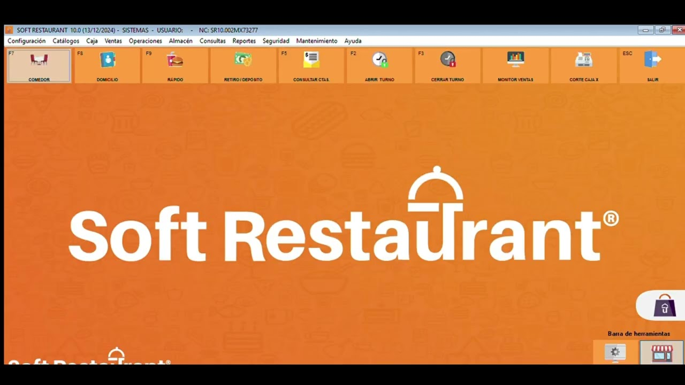

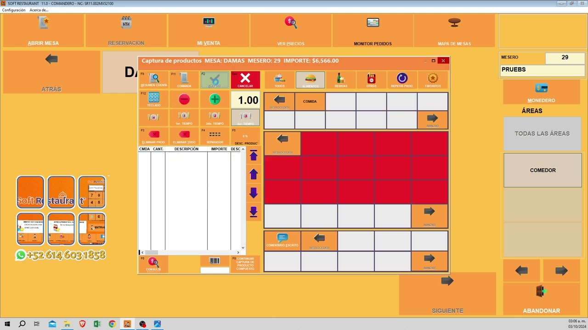

**Qué mirar:** ventana Windows con barra de MENÚS (11 menús) + ribbon de F-keys (F7 COMEDOR, F8 DOMICILIO, F9 RÁPIDO, F2/F3 TURNO, CORTE CAJA X) — **operación por teclado de 2010** · el comandero: modal "Captura de productos" con grid rojo de categorías, botonera F12/eliminar/separador, panel de mesero y áreas. Ventanas dentro de ventanas. El contraste con cualquier grid táctil ES la demo de venta.

### Square — menú con fotos (iPad)

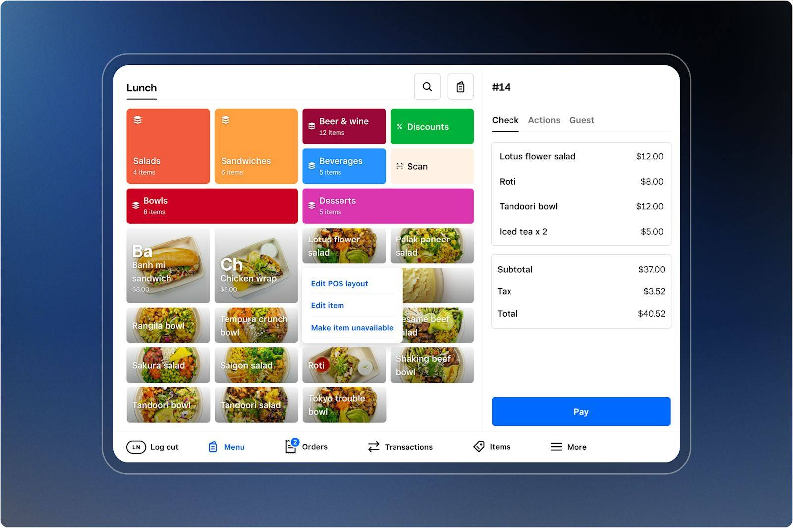

**Qué mirar:** el POS más visual de todos — categorías en colores saturados con conteo de items, **fotos de platillo como protagonistas**, check a la derecha con tabs Check/Actions/Guest, y menú contextual "Edit item / **Make item unavailable**" — el 86 a un long-press.

### Fullsite — NUESTRO producto (capturas reales, tenant demo diezmex, 2026-08-31)

El POS pide **PIN de mesero** antes de abrir el grid (gate de seguridad — buena señal de producto; captura del grid pendiente de un PIN demo sembrado). Lo que SÍ capturamos, y vende solo:

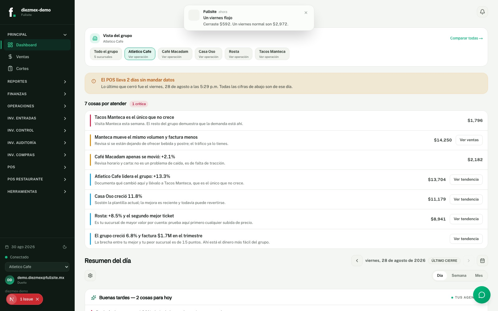

**Qué mirar (ESTA es la imagen de venta):** dashboard de grupo con 5 sucursales + **"7 cosas por atender" cada una con el peso al lado** ($14,250 · $13,704 · $11,179…) y frases de negocio en español de dueño: *"Tacos Manteca es el único que no crece"*, *"Ahí está el dinero más fácil del grupo"*. Ningún competidor tiene esto — Parrot/SR muestran tablas; nosotros mostramos DECISIONES en pesos. Y arriba, la notificación proactiva: *"Un viernes flojo — cerraste $592, un viernes normal son $2,972"*.

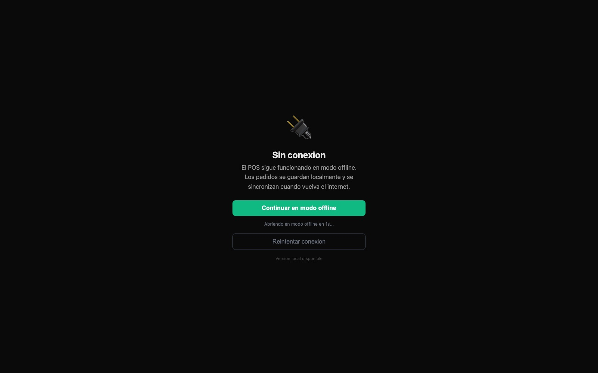

**Qué mirar:** *"Sin conexión — El POS sigue funcionando en modo offline. Los pedidos se guardan localmente y se sincronizan cuando vuelva el internet."* Esta es la pantalla del **"apaga el módem"** hecha producto — el asset visual del argumento offline.

Nuestras ventajas visibles: table map real (vs grid paginado de Parrot), web/PWA sin lock-in de hardware, dashboard en pesos con lenguaje de negocio. Robar aún: contador pre-86 en tile (Toast), fotos protagonistas (Square).

---

## 2. El KDS — la pantalla de cocina

### Toast — el estándar de oro (claro y oscuro)

**Qué mirar:** cronómetro + semáforo por ticket · **"NOT PAID"** (cocina ve qué cuenta sigue abierta) · contorno naranja = orden online · secciones por curso · Recall / All Day View / Recently fulfilled · filtro por estación en el título.

### Square — KDS en iPad

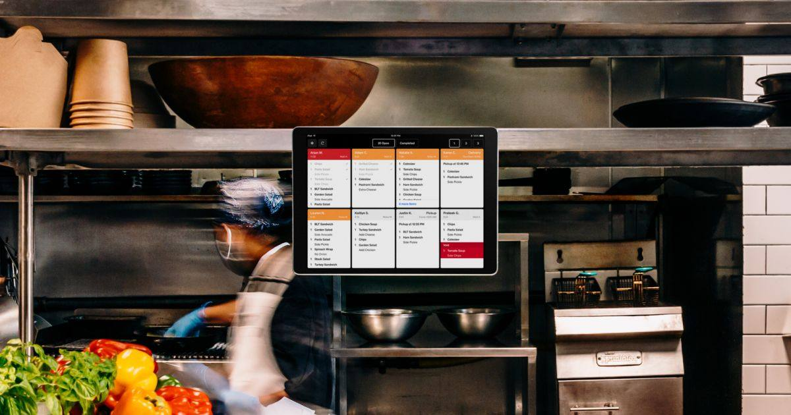

**Qué mirar:** columnas con header de color por estado (rojo/naranja/gris programado, fila VOID en rojo oscuro), toggle "Open/Completed", paginación por estaciones. Más simple que Toast — sin cursos visibles ni not-paid.

### Parrot — ❌ sin material público
Ni el demo ni el canal muestran su KDS. Se cierra en la demo comercial (pregunta 2 del guion). Sospecha [HIPÓTESIS]: básico — lista de comandas por tiempos, sin routing por estación.

### Soft Restaurant — módulo confirmado, captura decente pendiente
El "Monitor de producción" EXISTE y viene **incluido en SR12 PRO** (confirmado en su tienda). Material público: solo videos de distribuidores con branding encima — sin frame limpio. En el comandero SR aparecen los botones "MONITOR PEDIDOS" (`sr-comandero.jpg`).

---

## 3. El Dashboard / back-office — la pantalla del dueño

### Toast — Toast Web + Toast Now (celular)

**Qué mirar:** sidebar naranja con árbol de reportes (74 en 9 categorías) · en el celular, **cada KPI = valor + % vs referencia + sparkline** (nunca un número solo) · SPLH en primera pantalla.

### Parrot — ParrotConnect + Parrot App (la app del dueño, capturas oficiales de Play)

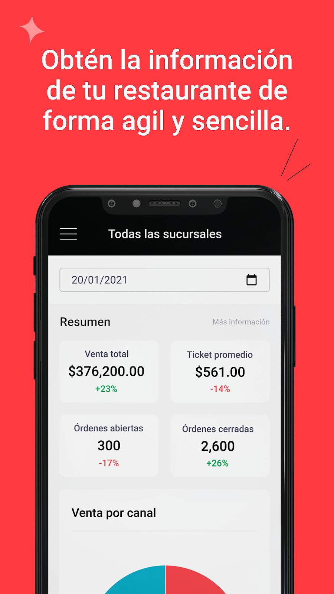

**Qué mirar:** home "Todas las sucursales" con 4 KPI cards (Venta total +23% verde, Ticket promedio −14% rojo, Órdenes abiertas/cerradas) + "Venta por canal". Delta % sí, **sparkline no** — la tripleta completa sigue siendo exclusiva de Toast. Solo **1K+ descargas** (adopción bajísima del app del dueño). Navegación de ParrotConnect web confirmada en tutoriales: Menú · Personal · Facturación · Configuración · Reportes. Los reportes web actuales: sin material público.

### Soft Restaurant — el admin Windows

La imagen de arriba (`sr-admin.jpg`) es también su "dashboard": menús en cascada hasta "Catálogo de SAT - México", MONITOR VENTAS y CORTE CAJA X como botones F-key. Analytics 3.0 (SR12, 25+ reportes) sin captura pública — demo con distribuidor.

### Soft Restaurant — las apps móviles (Play Store, capturas oficiales)

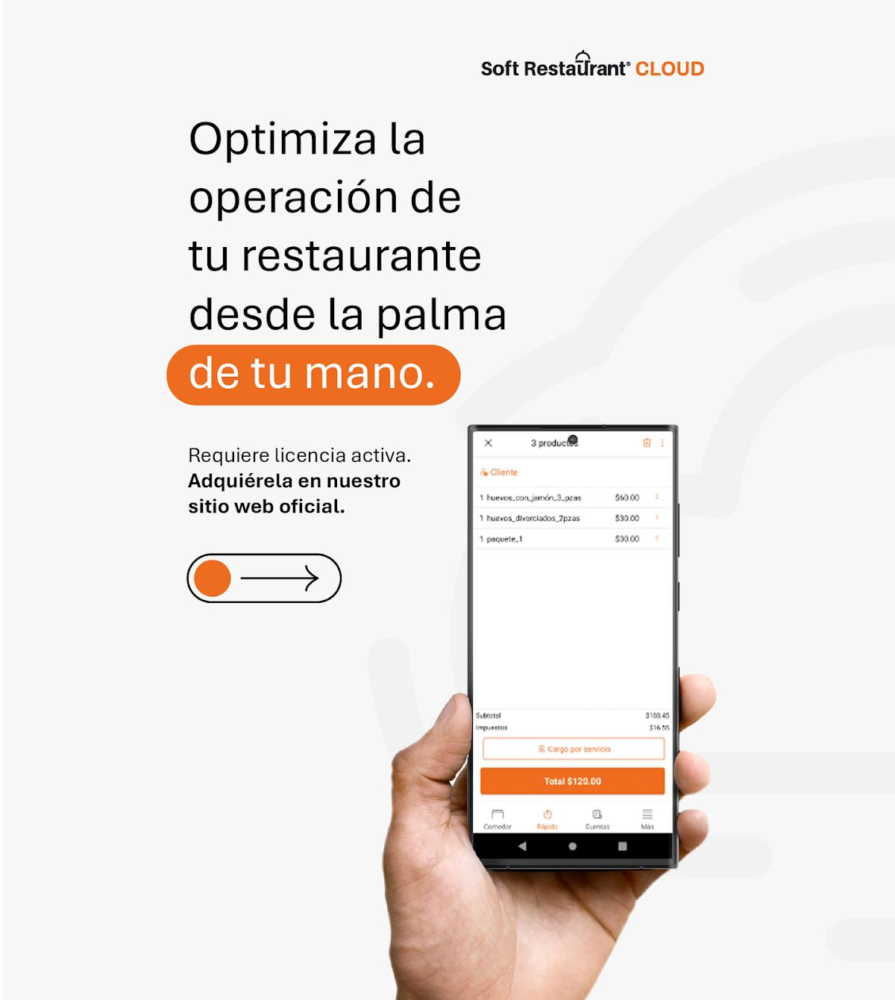

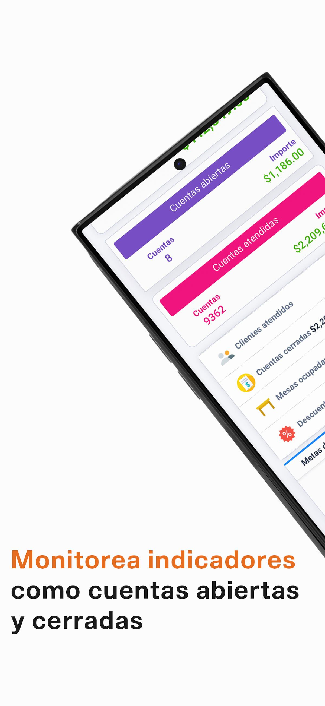

**Qué mirar:** SR Cloud (3.9★, 5K descargas) es un POS-celular simple — ticket con subtotal/impuestos y tabs Comedor/Rápido/Cuentas; las reseñas lo destrozan ("te obligan a comprar sus terminales", sin inventario ni recetas). SR Admin (3.6★) es el dashboard móvil **solo-lectura**: "editar un producto, receta o precio te obliga a estar en el restaurante" (reseña verificada). El dashboard remoto EDITABLE es diferenciador nuestro directo.

### Fullsite — NUESTRO dashboard (capturas reales)

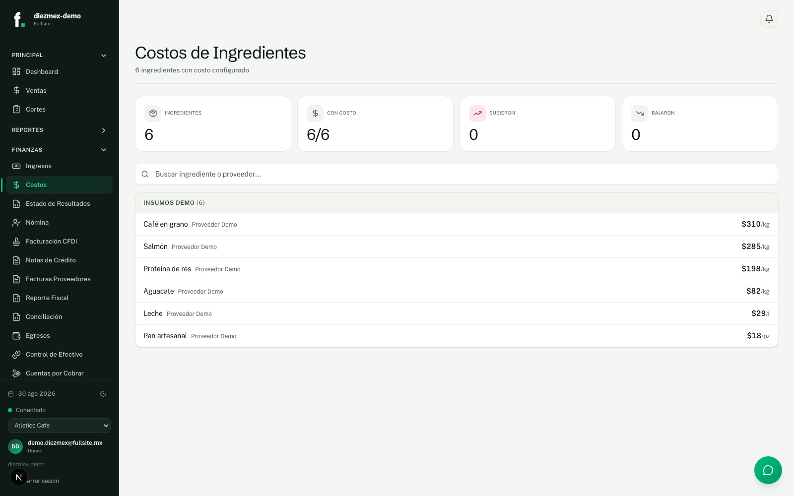

**Qué mirar:** Costos de ingredientes con KPIs (subieron/bajaron), proveedor por insumo, y en el sidebar la PROFUNDIDAD de Finanzas: Estado de Resultados, Nómina, **Facturación CFDI**, **Facturas Proveedores**, Conciliación, Cuentas por Cobrar. El back-office más completo del comparativo, en español, moderno, editable desde donde sea.

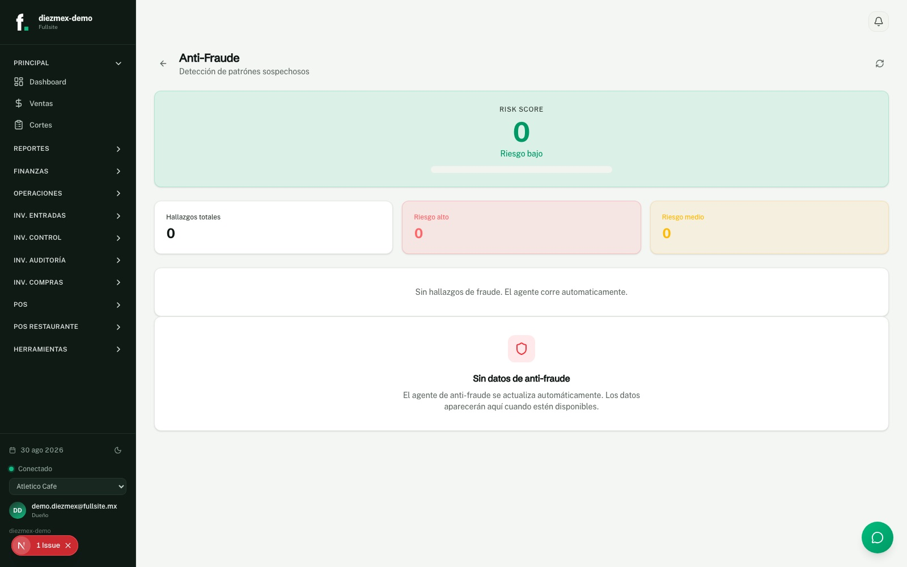

**Qué mirar:** el agente anti-fraude como pantalla propia (Risk Score, hallazgos por nivel) — lo que Toast trata como su categoría #1 de reportes, nosotros lo tenemos como agente que corre solo. (En esta captura el tenant demo no tiene hallazgos sembrados; muestra el layout limpio.)

### Square — ❌ sin captura buena
Su Dashboard web (reportes, close-of-day) no tiene screenshots públicos decentes; benchmark secundario, baja prioridad.

---

## 4. La lectura transversal (lo accionable)

1. **POS**: todos convergieron en ticket+grid; la batalla es el dato del tile (stock/foto/color) y los taps al 86.
2. **KDS**: Toast juega solo en otra liga (cursos, not-paid, recall, estación). Parrot y SR ni lo enseñan — **nuestro KDS 1.3.x ya compite arriba del promedio del mercado MX** [INFERENCIA].
3. **Dashboard**: la tripleta de Toast Now (valor+delta+sparkline) es el estándar a igualar en móvil; ParrotConnect es limpio pero pobre en insight; SR es un ERP de 2010.
4. **Diseño**: Toast = sistema público (Buffet) con identidad≠interacción; Parrot = plano rojo/blanco funcional; SR = naranja Windows denso; Square = fotos + redondeado friendly. Nuestro ds-v2.x compite bien en modernidad; el gap es consistencia de tokens (ver TOAST-BIBLE §15.6).

## Mantenimiento

Nueva captura → `assets/` con prefijo del competidor → fila aquí + detalle en su biblia. Las capturas de demos comerciales (Parrot KDS/reportes, SR12/KDS) entran en cuanto existan.
