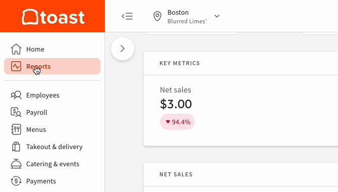
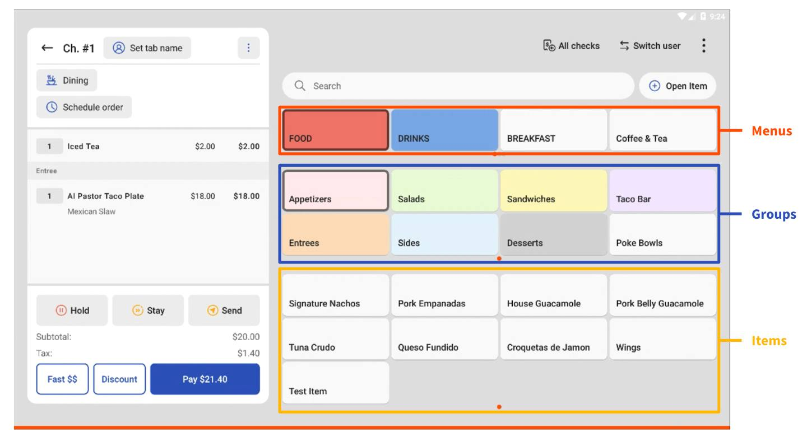
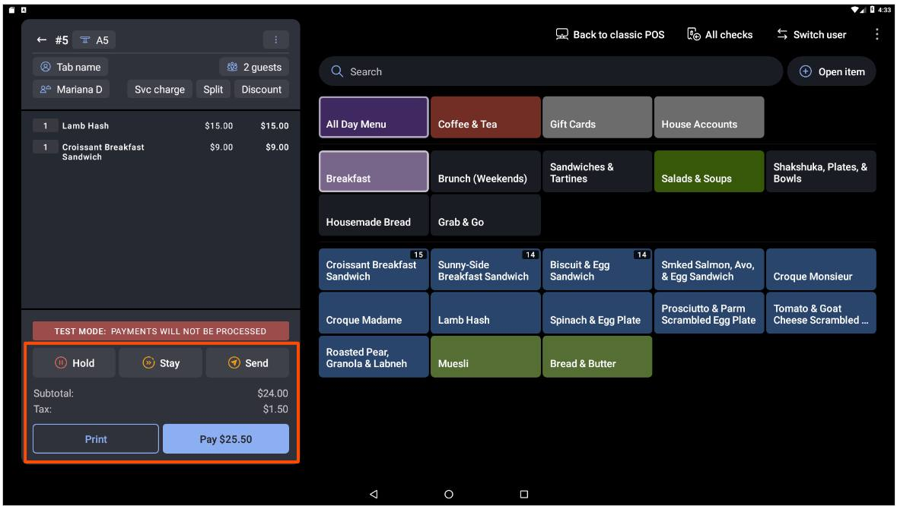
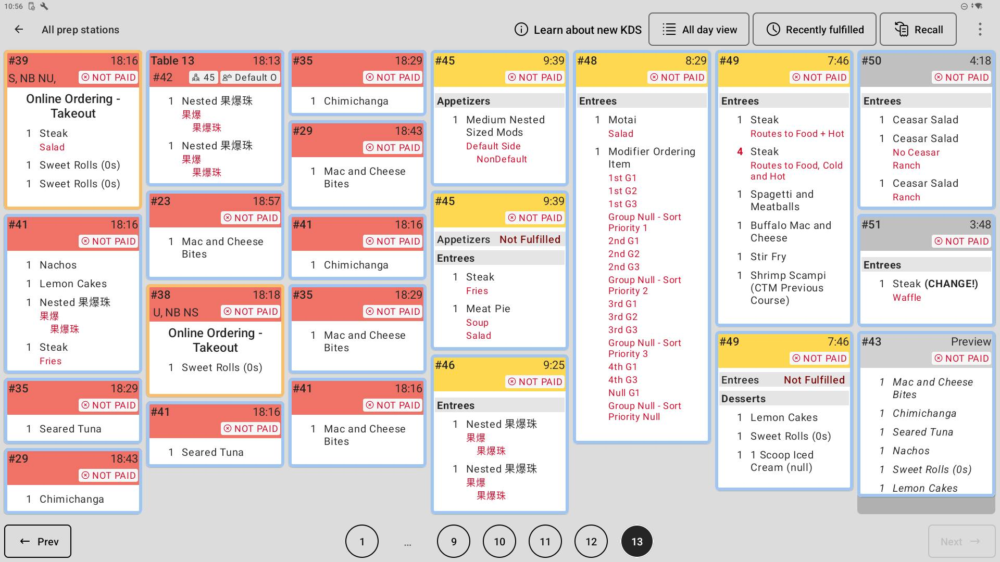
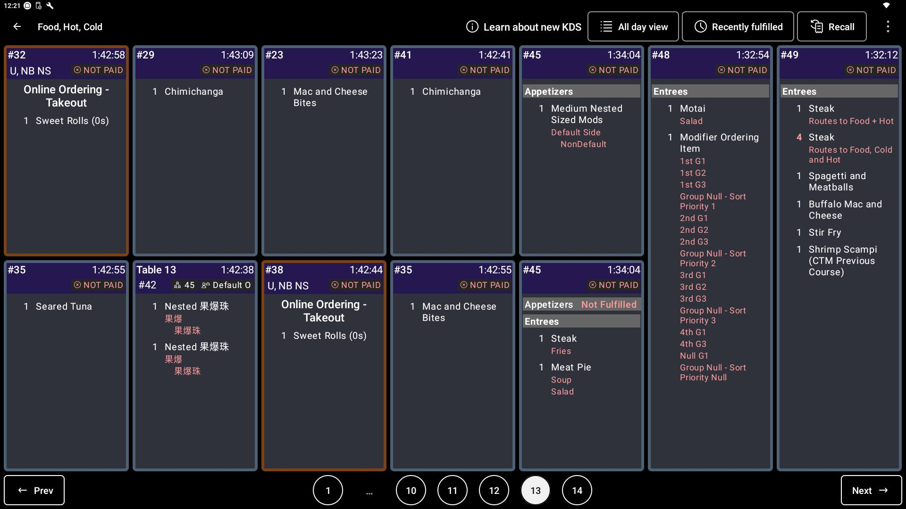
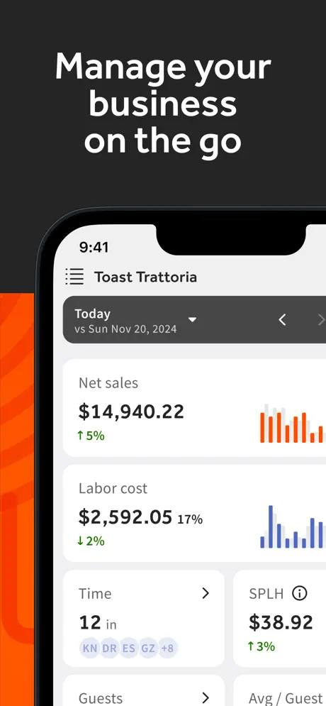

# TOAST BIBLE — el estándar de oro, de pies a cabeza

**Fecha:** 2026-08-27 · **Método:** sitio oficial (pos.toasttab.com, actualizado 2026-07-22), docs de plataforma (doc.toasttab.com), help center (support.toasttab.com), prensa, guías de pricing, reviews agregadas. Convención: [HECHO] = fuente pública verificada · [INFERENCIA] = derivado · [HIPÓTESIS] = por validar.
**Complementa:** `../COMPETITIVE-INTELLIGENCE.md` §2.1 y §4 (estrategia e historia). Este doc es la **anatomía del producto**.

---

## 1. Ficha

- Boston, fundada 2011. Pública (NYSE: TOST). **130,000+ locations** [HECHO — cifra propia 2026].
- Solo mercados anglo: US, UK, Irlanda, Canadá, Australia. **No está en México ni lo ha anunciado** [HECHO].
- Modelo: SaaS barato + **procesamiento de pagos obligatorio** (ahí está el negocio) + fintech encima (capital, checking, instant deposit).
- Por qué importa aunque no compita aquí: **define hacia dónde va la industria**. Todo lo que Toast lanza hoy (IA nativa, celular en el handheld, agregación de delivery) llega a México en 2-4 años vía imitadores.

## 2. Mapa completo del producto (9 suites, ~35 productos) [HECHO]

Del catálogo oficial (2026-07-22):

| Suite | Productos |
|---|---|
| **POS & Restaurant Ops** | Point of Sale · Toast Payments · Toast Now (app del dueño) · Mobile Order & Pay (QR en mesa) · Catering & Events (NEW) · Restaurant Retail (NEW) · Reporting & Analytics · Order-Ready Boards |
| **Marketing** | Email Marketing · Loyalty · Gift Cards · Toast Tables (NEW: reservas+waitlist+mesas) · Guest CRM · Advertising (Google/Meta con IA) |
| **Digital Storefront** | Online Ordering (first-party sin comisión) · Local by Toast (marketplace propio) · Toast Delivery Services (repartidores on-demand) · Third-Party Delivery Integrations · Toast Websites (NEW) · Branded Mobile App |
| **Hardware** | Toast Go 3 handheld · Kiosk · KDS · Toast Flex · Flex for Guest · Flex for Kitchen · Toast Tap |
| **Restaurant Management** | Benchmarking (vs peers) · Multi-Location Management · 170+ integraciones |
| **Supplier & Accounting** | xtraCHEF (OCR de facturas → costos) · Inventory |
| **Payroll** | Payroll & Team Management (mediana 15 min) · Pay Card & PayOut |
| **Team Management** | Tips Manager · Sling (scheduling + chat de equipo) |
| **Finance** | Capital Loans (15,000+ prestatarios, vía WebBank) · Toast Checking (aparta impuestos/nómina automático) · Instant Deposit (fee 1.75%) |

**Lectura:** Toast ya no es un POS — es un **sistema operativo financiero** del restaurante. El POS es el caballo de Troya del procesamiento; el procesamiento es el caballo de Troya del crédito. (Coincide con la lección de Alejandro: verdad de datos → crédito seguro → moat de pagos.)

## 3. El flujo completo — cómo conecta todo de pies a cabeza [SÍNTESIS de §4-§10, con fuente en cada pieza]

La anatomía está en las secciones siguientes; esto es el sistema respirando. Toast son **cinco flujos entrelazados**, y entender dónde se tocan es entender por qué gana.

### 3.1 El flujo de entrada (día 0 → primera venta)

Signup online ~10 min, sin fricción → hardware llega en 3-5 días **preconfigurado** (conectar y prender) → migración de menú asistida → Toast Classroom (entrenamiento en vivo de 60 min) + videos → **primera venta a las 24-48 h de recibir hardware**. Todo self-service con red de seguridad humana. La venta REAL ocurre después: ya adentro, el restaurante va adoptando módulos (land & expand) — empieza con POS y termina con payroll, marketing y crédito.

### 3.2 El flujo de la orden (el corazón operativo)

1. **Entra por cualquiera de 6 puertas**: mesero en Flex/Go 3 · QR en mesa (Mobile Order & Pay) · Kiosk · Online Ordering propio · marketplaces (3rd-party integrations, sin retecleo) · teléfono (voice AI). Todas convergen en el MISMO pipeline de órdenes.
2. **Toast Tables ya sabía que venías**: la reserva (hecha online o desde Google) sienta a la mesa; el host ve el estado en vivo.
3. **El check se construye** (Quick Order o Table Order): items con jerarquía Menus→Groups→Items, modificadores, cursos, **Hold/Stay/Send** controla el ritmo hacia cocina.
4. **Cocina**: routing automático por prep station → cada estación bumpea lo suyo → el **expeditor** consolida → "NOT PAID" visible en el ticket → Order-Ready Board avisa al comensal/repartidor. Prep-times alimentan analytics (y el auto-fire por prep time).
5. **Pago**: split hasta 50, propina sugerida en pantalla del cliente, tarjeta/Apple/Google/gift/loyalty. Si el comensal paga con tarjeta vinculada, **acumula lealtad sin decir nada** (card-linked).
6. **Cada paso emite datos** — la orden no termina en el pago: alimenta reportes, CRM, IQ y el flujo fiscal del dueño en tiempo real.

**El turno del mesero, de principio a fin [HECHO — artículos de soporte]:** clock-in con PIN de 4 dígitos en el mismo POS (el turno viene programado desde Sling) → el dispositivo abre en su modo (Table Service con mesas, o Quick Order de mostrador) → abrir mesa + comensales → construir el check (búsqueda, "Open Item" para fuera de menú, modificadores obligatorios que BLOQUEAN hasta resolverse, asientos por comensal) → **Hold / Stay / Send** decide qué viaja a cocina y cuándo → durante el servicio: agregar rondas, mover el check a otro mesero, service charge, transferir/juntar mesas → cobro: Print → Pay → split (por item, porcentaje o partes iguales, hasta 50) → propina en la pantalla del cliente o en el Go 3 (que cobra hasta en la banqueta, por celular) → clock-out con declaración de propinas. Todo el turno sucede sin salir del POS.

### 3.3 El flujo del ticket en cocina (KDS, ciclo de vida completo)

1. **Send** en el POS dispara el ticket → **routing automático**: cada item está mapeado a su prep station (parrilla, freidora, ensaladas...) y solo aparece donde se prepara.
2. **Firing**: inmediato, por curso (los postres no se disparan con las entradas), o **auto-fire por prep time** — la estación con preparación más larga arranca primero para que todo el curso salga JUNTO.
3. **En pantalla**: cronómetro por ticket con umbrales de color (verde→amarillo→rojo), modificadores en rojo, **"NOT PAID"** visible (cocina sabe qué cuenta sigue abierta), contorno naranja = orden online/takeout, origen visible (Mesa 13 / Online Ordering).
4. **Bump por estación** → cuando TODAS las estaciones terminaron, el ticket se consolida en el **expeditor** → el expo bumpea → **Order-Ready Board** muestra el nombre al comensal/repartidor.
5. Herramientas de servicio: **Recall** (des-bumpear un error) · **All Day View** (conteos agregados por item: "van 14 croissant sandwiches") · Recently Fulfilled (auditar lo que ya salió).
6. **Cada bump alimenta analytics**: fulfillment time por estación y por hora → los 3 reportes de Kitchen Ops → y el auto-fire aprende de esos prep times. El KDS no es una pantalla: es el sensor de throughput de la cocina.

### 3.4 El flujo del apagón (offline, minuto a minuto) [HECHO — docs oficiales]

1. Se cae el internet → **banner** arriba del POS + diálogo automático: qué puedes hacer y qué evitar.
2. Con "local sync": el **hub único** (auto-elegido por Toast: Ethernet, no handheld, uno por red) releva POS→KDS. Pero **las órdenes de un POS NO aparecen en otro POS** — cada mesero debe operar en UN solo dispositivo todo el apagón.
3. Cobros: efectivo sí; tarjeta solo **banda magnética** (EMV apagado), guardada localmente; gift cards, loyalty y house accounts NO funcionan. Guardar recibos firmados por si el pago se pierde.
4. Reglas de supervivencia (suyas, textuales): no cerrar sesión (no podrás volver a entrar), no reinstalar la app ni limpiar caché (**borra los pagos almacenados permanentemente**), no apagar el router, no cambiar de red.
5. Regresa el internet → sync automático de la cola → los pagos almacenados se capturan. Si NO reconectaste antes del fin del día: **llamar a soporte** para pausar el auto-capture.
6. Riesgo residual asumido por el restaurante: tarjetas que declinan al capturarse horas después = pérdida. **Contraste Fullsite**: nuestro Bridge es un servidor local con estado COMPARTIDO — dos cajas y tres comanderas se siguen viendo entre sí sin internet. En el apagón, un Toast opera como islas; un Fullsite opera como restaurante.

### 3.5 El flujo del dinero (donde vive el negocio de Toast)

Venta con tarjeta → **procesamiento Toast obligatorio** (2.49% + 15¢, o 3.09-3.69% en Starter) → depósito al día siguiente, o **Instant Deposit** (segundos, fee 1.75%) → **Toast Checking** aparta automático impuestos y nómina → **Payroll** paga (mediana 15 min de proceso), tips del POS ya pooleados por **Tips Manager** → empleado puede cobrar en **Pay Card** → y si el restaurante necesita capital, **Toast Capital** presta con repago como % de ventas futuras — que Toast ve y cobra en la fuente porque procesa cada transacción. **El círculo se cierra: cada dólar del restaurante pasa por Toast en 4 momentos distintos** (cobro, banco, nómina, crédito). El POS de $69/mes es la puerta; esto es la casa.

### 3.6 El flujo del dato → decisión

Transacción → **74 reportes en 9 categorías** (tiempo real, comparativos YoY) → **Benchmarking** contra restaurantes similares (moat de 130K locations) → **ToastIQ** encima de todo: feed "For you" con recomendaciones proactivas, preguntas en lenguaje natural hasta nivel modificador, y ACCIONES con confirmación (editar menú, 86, turnos, drafts de campañas) → el dueño ejecuta desde **Toast Now** en el celular (throttle de delivery, 86, turnos) sin abrir la laptop. El loop completo dato→insight→acción vive dentro de Toast.

**El día del dueño, como lo diseñó Toast:** 7 am — Toast Now en el celular: ventas de ayer vs mismo día de la semana pasada, labor %, quién ya está clocked-in · media mañana — se acabó un platillo: 86 desde el celular; cocina saturada: throttle del online ordering · lunes — Toast Web: Weekly Overview → drill al Sales Summary → PMIX para decidir menú → Cash & Loss para cuadrar descuentos/voids → email export al contador · duda suelta — se la pregunta a ToastIQ y ejecuta con confirmación · quincena — Payroll en ~15 min porque los tips ya vienen pooleados y las horas ya están en el sistema. **El dueño nunca sale del ecosistema para decidir.**

### 3.7 El flujo del comensal (el flywheel de demanda)

Primera visita → paga con tarjeta → **Guest CRM** crea el perfil (órdenes+visitas+reservas unificadas) → loyalty acumula (card-linked, puntos fraccionales pre-tax) → **email/SMS marketing** — que ToastIQ redacta y el dueño aprueba — lo trae de vuelta → reserva por **Google/Toast Tables** → el host lo recibe sabiendo qué pidió la vez pasada → repite. Cada vuelta engorda el perfil y afina la siguiente campaña.

### 3.8 El flujo de costos (el espejo de nuestra recepción CFDI)

Factura del proveedor → foto/email a **xtraCHEF** → OCR línea por línea (<24 h) → GL auto-coding → sync contable (QuickBooks/Sage) → costos de ingredientes actualizados → **recipe costing** cruza con el mix de ventas del POS → margen real por platillo → menu engineering (PMIX) → reprecio. Entradas (facturas) y salidas (ventas) cerradas en un solo sistema — la "verdad de inventario" de Alejandro, versión gringa con OCR.

### 3.9 La síntesis en una frase

**Toast convierte cada orden en cuatro negocios** (procesamiento, banca, nómina, crédito) **y cada dato en retención** (reportes→IQ→acción; comensal→CRM→campaña→regreso). El POS casi se regala porque no es el producto — es el punto de captura. Nuestra versión de esta lógica: el POS captura, la IA decide, WhatsApp conversa — y el CFDI nos da gratis lo que a ellos les cuesta OCR y 24 horas.

## 4. El POS de pies a cabeza

### 4.1 Flujo de cobro [HECHO — docs + demos públicas]
- Grid de categorías touch con imágenes; búsqueda rápida por nombre.
- Modificadores en modal: obligatorios vs opcionales.
- Split checks nativo: por item o porcentaje, hasta 50 divisiones.
- Propinas sugeridas en pantalla del cliente (18/20/22%, customizable).
- Pagos: cash, tarjeta, Apple/Google Pay, gift cards.
- <2 segundos por transacción en su hardware.

### 4.2 Permisos y roles [HECHO]
- Niveles Employee/Manager/Admin/Owner + **100+ permisos granulares** ("puede aplicar descuento >20%", "puede ver food cost", "puede cerrar caja").
- PIN de 4 dígitos por empleado; fingerprint en hardware nuevo. Clock-in/out integrado al POS.
- Audit trail de toda acción (quién, cuándo, qué).

### 4.3 Hardware [HECHO]
- **Toast Go 3** (global desde 2026-04-28): 6.52", >24 h batería (carga 4.5 h), IP65, caídas 1.5 m, 16% más ligero que Go 2, cámaras frontal+trasera, **WiFi + CELULAR nativo**, ToastIQ integrado. El mesero cobra en la banqueta sin red del local.
- Flex (terminal), Flex for Guest (pantalla al cliente), Flex for Kitchen, Tap (lector), Kiosk, KDS propio. Todo Android propietario.

### 4.4 KDS [HECHO]
- Routing por estación (parrilla/freidora/ensaladas) automático por item.
- Timers con semáforo (verde→amarillo→rojo). Bump por estación; la orden se completa cuando todas terminan.
- **Expeditor mode**: vista unificada para coordinar estaciones. Prep-time analytics por estación.

### 4.5 Offline — su talón de Aquiles arquitectónico [HECHO — doc.toasttab.com]

**Modo básico:** si no hay cloud, **los dispositivos NO se comunican entre sí** (comunicación mediada por nube, no P2P). Pagos offline solo banda magnética (EMV deshabilitado), almacenados localmente. Checks offline numerados: `(device_id + 2) × 1000 + secuencial`.

**"Offline mode with local sync" (el parche):** UN dispositivo actúa de hub local — elegido AUTOMÁTICO por Toast, solo reasignable llamando a soporte. Requiere Ethernet, no puede ser handheld, un solo hub por red, subredes no comparten datos. **Las órdenes de un POS NO se ven en otro POS offline** (solo POS→KDS). Y sus propias reglas de supervivencia lo delatan:
- "No desinstales la app ni limpies caché — **borra permanentemente los pagos almacenados**."
- "No cierres sesión — no podrás volver a entrar hasta reconectar."
- "Cada empleado debe usar UN solo dispositivo mientras dure el offline."
- "Guarda copias firmadas de los recibos por si el pago se pierde."
- Si no reconectas al fin del día: llamar a soporte para desactivar el auto-capture.

**No disponible offline:** kiosk, clock-in entre dispositivos, datos de clientes, gift cards, loyalty, house accounts.

**Contraste Fullsite [INFERENCIA sobre HECHO]:** nuestro Bridge LAN es un servidor local real con estado compartido entre dispositivos. Toast, con $14B de market cap, tiene un relay de hub único donde las órdenes viven aisladas por dispositivo. **En offline, Fullsite es arquitectónicamente superior a Toast.** Esta comparación pertenece al pitch.

## 5. El back-office (Toast Web) de pies a cabeza [HECHO — support.toasttab.com]

Navegación: menú izquierdo → **Reports** → abre Weekly Overview → flecha expande el árbol completo. **9 categorías, ~74 reportes:**

| Categoría | # | Reportes clave |
|---|---|---|
| Sales | 11 | Sales Summary, Sales Analytics, Sales Breakdown, Marketing-driven sales, Digital Order Sources, Orders, Order Details, Paid in Total, Deposit Sales, Location Breakdown, Group Sales Overview |
| Labor | 13 | costos, time entries, ventas por hora, productividad por empleado, shifts, tips, break adherence, audits |
| Menu | 8 | **Product Mix (PMIX)**, Menu Breakdown, Top Items/Groups/Modifiers, Item Details, Modifier Details, **86 Report**, **Food Waste Breakdown** |
| Payments | 14 | payouts, **reconciliation**, chargebacks, deposits, card activity, gift cards, billing |
| **Cash & Loss Management** | 15 | cash audits, drawers, **voided/removed items**, loyalty misuse, discounts, refunds, end-of-day |
| Accounting | 4 | Overview, By Day, By Location, GL codes / House Accounts |
| Kitchen Ops (requiere KDS) | 3 | Tickets by Fulfillment, By Hour, Details |
| Marketing (requiere Loyalty) | 6 | feedback, rewards, credits, fundraising |
| Other | — | reservas, waitlist, comparación de sucursales |

- Filtros: rango, horas, empleados, sucursal(es), dining type, revenue center. **Comparativos YoY / periodo previo / sucursales lado a lado** (azul vs naranja). Columnas customizables por reporte.
- Export: email (.xls/.csv), Excel directo, print-to-PDF.
- **Lo notable:** "Cash & Loss Management" es la categoría MÁS GRANDE (15 reportes). Toast trata el anti-fraude como categoría de primer nivel, no como feature — valida nuestra tesis del antifraude como producto.

### Toast Now (la app del dueño) [HECHO]
- Ventas/tráfico/labor en tiempo real, hora por hora, vs mismo día de la semana pasada y del año pasado.
- Quién está clocked-in; editar turnos; tips; breaks.
- **Acciones**: throttle de online ordering, snooze de takeout/delivery, 86 de items desde el celular.
- Manager log sincronizado con Toast Web + threads con el staff.
- Multi-sucursal con un login.

## 6. ToastIQ — su capa de IA (2025-2026) [HECHO]

- Lanzada 2025; expandida a "Smart AI Assistant" (oct-2025, linaje "Sous Chef"); **Toast IQ Grow** (marketing/demand, primavera 2026).
- Tres capacidades: (1) feed **"For you"** de recomendaciones personalizadas y oportunas; (2) **preguntas en lenguaje natural** sobre el negocio con consejo a la medida; (3) **acciones desde la conversación** — editar menú, editar turno, modificar item.
- Voice-AI (llamadas): +6% volumen de orden por upsells de IA (dato propio).
- Motor: 130K+ locations, millones de transacciones — su moat es la ESCALA de datos.
- Go 3 lleva ToastIQ en el handheld.

### ToastIQ por dentro (artículo oficial de soporte, 2026) [HECHO]

- **Dónde vive:** esquina superior izquierda de Toast Web + barra inferior de Toast Now. Mid-Market/Enterprise requieren aprobación de su CSM.
- **Permisos:** mínimo "4.1 Sales Reports" o "4.3 Labor Reports"; cada ACCIÓN exige el permiso correspondiente (editar menú requiere permisos de menú). La IA hereda el modelo de permisos existente — no lo brinca.
- **Preguntas que responde:** ventas ("¿cuántas hamburguesas vendimos la semana pasada?"), reportes A NIVEL MODIFICADOR ("¿qué add-ons son más populares con la Cheeseburger?"), labor/turnos, políticas de propinas, settings de cocina (prep times, estaciones), configuración FOH, estatus de Toast Delivery (orden, repartidor, refunds).
- **Acciones que ejecuta (con confirmación explícita del usuario):** actualizar items, ajustar stock, marcar 86, editar turnos, configurar upsells, cambiar settings de FOH y cocina (estación, assembly line, sort order, prep time), redactar campañas de email (US/UK/IE/CA) y SMS (US).
- **Límite clave:** las campañas las deja en BORRADOR — "no enviará ni programará una campaña por sí sola". El humano publica.
- **Datos:** instancia enterprise dedicada del proveedor LLM; "no se usan para entrenamiento general"; sin mezcla entre clientes. No se puede desactivar del todo a nivel cuenta.
- **UX:** multiidioma (español incluido, por sesión), historial de chats, rating por respuesta, descarga de tablas, y el disclaimer "AI tools can make mistakes".

**Lectura para Fullsite:** Toast validó nuestra tesis completa — IA operativa nativa del POS con feed de recomendaciones (= agentes), chat en lenguaje natural (= copiloto) y acciones desde el chat (ahí van adelante; nuestro chat aún no ejecuta acciones). Su ventaja: datos. La nuestra: México — CFDI, WhatsApp como canal (ellos usan app propia), español operativo, ticket de $2K MXN vs $10K USD de entrada, y offline real.

## 7. xtraCHEF por dentro — el espejo de nuestra recepción CFDI [HECHO — soporte oficial]

**Flujo factura→insight:** (1) captura por app móvil (iOS/Android), escáner de escritorio, o **email a un inbox dedicado por sucursal**; (2) OCR+ML lee proveedor, número de factura, producto, unidad, cantidad y costo **línea por línea**; (3) los datos aparecen en la cuenta **en <24 h** (no es instantáneo — hay humanos en el loop [INFERENCIA]); (4) sincroniza ventas de Toast diario → COGS real vs presupuesto; (5) costeo de recetas por platillo combinando precios fluctuantes + mix de ventas on/off-premise → margen bruto por item.
- **GL auto-coding:** asignas código contable y categoría UNA vez; las siguientes facturas del mismo item se codifican solas. Sync a QuickBooks Online y Sage Intacct.
- **Tiers:** Essentials (facturas, sync contable, food cost, price tracker, vendors) vs Pro (+ costeo de recetas + inventario con conteo móvil y varianza — "waste, theft, breakage, shrinkage").
- **Solo US.** Precio: cotización custom.
- **Lectura:** nuestro equivalente mexicano es MEJOR de raíz: el CFDI XML ya trae los datos estructurados — no necesitamos OCR ni 24 h ni humanos. La factura electrónica obligatoria convierte su feature premium en nuestra ingesta directa. OP-21 con esta referencia deja de ser "pendiente fiscal" y se vuelve "xtraCHEF gratis y al instante".

## 8. La API y la arquitectura técnica [HECHO — doc.toasttab.com + technology.toasttab.com]

**Superficie completa de APIs (17):** analytics (era) · cash management · configuration (GUIDs de revenue centers, dining options, pagos) · credit cards (ccpartner) · device details · gift cards (outbound) · **kitchen** (prep stations + fulfillment) · **labor** (CRUD completo de empleados, jobs, turnos, time entries) · loyalty (outbound) · menus (menú resuelto completo) · **orders** (GET/POST/PATCH de órdenes, checks, pagos) · order mgmt config · packaging · partners · restaurant availability · restaurants · **stock** (GET/POST/PUT de inventario por item/modificador) · tender (outbound).
- Patrón notable: gift cards, loyalty y tender son **outbound** — TÚ hospedas el endpoint y Toast te llama. Así integran proveedores de terceros sin abrir su núcleo.
- 4 tipos de acceso: partner / custom / standard API / analytics API — permisos por integración, no todo-o-nada.
- **Stack** (blog de ingeniería oficial): POS Android en **Java/Kotlin** · backend de microservicios contenedorizados REST + gRPC (Java/Kotlin) · integraciones sobre **Apache Camel** · mensajería **Apache Pulsar** · frontends **React + GraphQL**.
- **Lectura:** la API pública de Toast es el catálogo de lo que un POS maduro DEBE exponer. Cuando abramos la nuestra, esta lista es el checklist — y labor/stock/orders con escritura son el mínimo para partners serios.

## 9. Guest Suite por dentro — Tables, Loyalty, CRM [HECHO — soporte oficial]

**Toast Tables** (2023→): app de host en iPad o tablet Android + config/reportes en Toast Web.
- **Estado de mesa alimentado por el POS y el KDS en tiempo real**: el host ve qué ordenó cada mesa, cuándo salió de cocina y cuándo pagaron — reservas y operación en el MISMO sistema (su ventaja estructural vs OpenTable).
- Waitlist con SMS configurable (confirmaciones, avisos, recordatorios) · perfiles de comensal (ocasiones, VIPs, preferencias) que alimentan Marketing/Loyalty · **reserva directa desde Google Business Profile**.
- Pricing: tarifa plana mensual, **sin fee por cover** (ataque directo al modelo OpenTable de $1-7.50/cover).

**Toast Loyalty** — mecánica exacta:
- Puntos por dólar PRE-impuestos y sin descuentos (ni tips, ni taxes, ni gift cards) · puntos FRACCIONALES (gasta $10 con regla de 1 pto/$15 → 0.66 pts) · sin tope de puntos ni de saldo.
- Alta con email O teléfono (uno basta) en POS, online, kiosk, pantalla de cliente o link · **la tarjeta bancaria puede quedar vinculada como identificador** (pagas con la misma tarjeta = acumulas sin decir nada).
- Configurable: ganar por gasto o por visitas; recompensas de item gratis a cashback.
- **Lectura:** card-linked loyalty es la fricción CERO — nadie en MX lo hace. Y Tables demuestra que reservas+POS+cocina en un solo sistema es el argumento contra los OpenTable/CoverManager: nosotros ya tenemos esa unión nativa con amalay_reservaciones.

## 10. Payroll & Team por dentro [HECHO]

- **Sling** (adquirida 2022): scheduling con templates, forecast de labor % contra ventas importadas del POS (presupuesto ANTES de publicar el horario, alertas de overtime), shift trades/disponibilidad/time-off, mensajería de equipo, multi-sucursal. Timesheets editados en Sling → Toast Web → Payroll.
- **Tips Manager:** pools de propinas del POS sincronizados DIRECTO a payroll — "elimina el Excel". (El Excel de propinas es exactamente lo que AMALAY hace hoy — dolor validado.)
- **Pay Card / PayOut:** tarjeta de nómina + adelantos de sueldo para empleados — retención de staff como feature del POS.
- Payroll: mediana de procesamiento 15 min; bundle $90/mes + $9/empleado.

## 11. Pricing 2026 [HECHO — guías públicas]

| Plan | Software | Procesamiento |
|---|---|---|
| Starter Kit | $0/mes, hardware $0 upfront | 3.09–3.69% + $0.15 (según bundle) |
| Point of Sale | $69 USD/mes | 2.49% + $0.15 |
| Payroll bundle | $90/mes + $9/empleado | — |
| Build Your Own | ~$110–165+/mes | negociado |

- Hardware (compra): Go 2 $494 · Flex+Tap $719 + $50/mes · +pantalla cliente $944 + $50/mes · KDS $674 + $35/mes · Kiosk $1,034 + $90/mes · impresoras $296–431 · cajón $134.
- Add-ons/mes: Online Ordering $75 · 3rd-party integration $75 · Loyalty $50 · Gift cards $50 · KDS sw $25 · Kiosk sw $90 · Email mkt $75 · Catering $100 · Websites $75.
- **Contratos 1–3 años · early termination $5,000–10,000 · procesamiento Toast EXCLUSIVO.**
- Costo real todo incluido: café de 10 mesas ~$250–500 USD/mes; full-service de 30 asientos $700–1,200 USD/mes, ANTES de fees de procesamiento.

## 12. Debilidades documentadas (2026) [HECHO]

1. **Fees ocultos — queja #1**: comisión extra de 2.5–3.5% en online ordering encima del procesamiento; subidas de precio unilaterales en add-ons.
2. **Outages**: 317+ desde ago-2022; 16 incidentes en los últimos 90 días medidos; oct-2026 dos caídas consecutivas de >10 horas. Con offline débil, cada outage es servicio parado.
3. **Soporte**: Trustpilot 3.1/5 (1,402 reviews), 235 quejas BBB; ventas agresivas.
4. **Lock-in**: hardware propietario + procesamiento obligatorio + contrato multianual con penalización de miles de dólares.

## 13. Qué copiar · qué evitar · cómo ganarle

**Copiar:**
- "Cash & Loss Management" como categoría de primer nivel del dashboard (15 reportes) — nuestro antifraude merece ese rango, no un rincón.
- Toast Now: comparativo "vs mismo día semana pasada/año pasado" hora por hora + ACCIONES desde el celular (86, throttle) — nuestro dashboard móvil debe permitir actuar, no solo mirar.
- Expeditor mode y prep-time por estación en KDS.
- ToastIQ "For you" feed: recomendaciones oportunas, no reportes crudos. (Ya es nuestra dirección — Toast la valida.)
- El QR de mesa (Mobile Order & Pay) como expansión natural del ticket.
- Benchmarking vs peers: cuando tengamos 20+ clientes, "tu café vs cafés similares" es un moat de datos que nadie en MX tiene.
- **Card-linked loyalty** (§9): la tarjeta como identificador de lealtad = fricción cero. Nadie en MX lo hace.
- **El framing xtraCHEF→CFDI** (§7): su feature premium con OCR y 24 h de espera es nuestra ingesta CFDI directa e instantánea. Ese contraste es una diapositiva de venta.
- **El patrón de APIs outbound** (§8): loyalty/gift-cards/tender donde el partner hospeda el endpoint — así se integran terceros sin abrir el núcleo. Modelo para nuestra API pública.
- **Tables sin fee por cover** contra los modelos por-comensal — mismo ataque nuestro contra OpenTable/CoverManager si empujamos reservas.
- **La IA hereda permisos y deja campañas en borrador** (§6): dos decisiones de diseño correctas que nuestro copiloto debe adoptar tal cual — el agente no brinca el modelo de permisos y el humano publica.

**Evitar:**
- El resentimiento por fees ocultos: nuestra promesa de precio fijo transparente es un arma directa contra el modelo Toast/Parrot Pay.
- El lock-in contractual como retención: retención por valor, no por castigo.
- La fragilidad offline "no cierres la app o pierdes pagos".

**Cómo ganarle (a sus imitadores en MX — Toast no está aquí):**
- Offline: la nuestra es arquitectura de servidor local real; la de ellos, un relay frágil. Demo de "apaga el módem" en cada venta.
- CFDI + WhatsApp + español: Toast no lo tiene ni lo tendrá pronto; sus imitadores MX tampoco tienen la capa IA.
- Velocidad: ellos actualizan trimestral con burocracia pública; nosotros en días.

## 14. Así se ve — pantallas reales, ilustrado (2026-08-27) [HECHO — imágenes oficiales de Toast, descargadas a `assets/`]

### 14.1 Toast Web — navegación del back-office

Sidebar naranja: Home · **Reports** · Employees · Payroll · Menus · Takeout & delivery · Catering & events · Payments. Al abrir Reports aparece el **segundo panel con el árbol de reportes** (Sales · Employee performance → Time entries / Hourly sales / Employee productivity / Labor summary...). El dashboard de inicio es de tarjetas KPI ("Net sales" con % vs periodo en badge).
**Qué mirar:** dos niveles de navegación (módulo → reporte) mantienen las 9 categorías navegables sin megamenú. El export pesado NO es en vivo: botón "Email Export" → correo "Your report is ready".

### 14.2 POS — Quick Order (mostrador, tema claro)

Ticket a la izquierda (tab name, dining option, Hold/Stay/Send, Subtotal+Tax, "Fast $$", Discount, Pay). A la derecha la jerarquía de TRES niveles siempre visible — la imagen oficial de Toast la anota: fila de **Menus** (FOOD rojo, DRINKS azul...) → fila de **Groups** (Appetizers rosa, Sandwiches amarillo...) → grid de **Items**.
**Qué mirar:** color-coding fuerte por categoría; búsqueda + "Open Item" arriba; los tres niveles colapsan la navegación a cero taps de profundidad — nunca "entras" a una categoría, todo está en pantalla.

### 14.3 POS — Table Order (servicio a mesa, tema OSCURO)

Header del check: #orden, mesa A5, comensales, mesero ("Mariana D") y accesos directos **Svc charge / Split / Discount**. Banner "TEST MODE" cuando aplica. Botón "Back to classic POS" (la migración al New POS Experience es opt-out — conviven dos generaciones de UI).
**Qué mirar:** los tiles de platillo llevan un **contador arriba (15, 14...)** = cuántos quedan antes del 86. El inventario vive EN el grid, visible al mesero. Es el detalle más robable de toda la pantalla.

### 14.4 KDS — tema claro ("All prep stations")

Tickets en columnas: cabecera con #orden + **cronómetro**, color por urgencia (rojo = tarde, amarillo = alerta), **contorno naranja = orden online/takeout**, gris = preview. Badge **"NOT PAID"** por ticket. Dentro: origen (Table 13 / Online Ordering), secciones por curso (Appetizers/Entrees/Desserts), modificadores en rojo, "Not Fulfilled", items cumplidos en gris itálico. Botones: All day view · Recently fulfilled · **Recall**. Paginación (aquí va en la página 13).
**Qué mirar:** el "NOT PAID" une cocina y caja — cocina sabe qué cuenta sigue abierta. Y el contorno naranja separa delivery de sala de un vistazo.

### 14.5 KDS — tema oscuro (estación "Food, Hot, Cold")

La misma pantalla filtrada por estación, en dark mode (el default de cocina). Cronómetros largos visibles (1:42:58 — la demo tiene tickets viejos), grid de 2 filas.
**Qué mirar:** el filtro de estación vive en el título; un dispositivo = una estación o el expeditor consolidado.

### 14.6 Toast Now — la app del dueño

Home = tarjetas KPI apiladas con el selector "Today vs Sun Nov 20" arriba: Net sales ($14,940.22 ↑5% + sparkline), Labor cost ($2,592.05, 17% de ventas, ↓2%), Time (12 clocked-in con chips de empleados), SPLH ($38.92 ↑3%), Guests, Avg/Guest.
**Qué mirar:** **ningún número aparece solo** — siempre valor + % vs referencia + minigráfica. Esa tripleta es el estándar que nuestro dashboard móvil debe igualar. Y SPLH como métrica de primera pantalla.

### 14.7 Las lecturas transversales [INFERENCIA]

- El layout POS de la industria convergió (ticket + jerarquía a la derecha); la diferencia competitiva está en QUÉ dato extra vive en el tile — Toast: stock restante; Square: foto; Parrot: franja de color.
- Tema oscuro para KDS y table-service nocturno es estándar; nuestro POS debería ofrecerlo (el KDS ya lo tiene).
- El export asíncrono por email es fricción que nosotros no tenemos — punto de demo.

## 15. Material de estudio [HECHO — enlaces verificados por búsqueda]

- **Canal oficial YouTube "Toast, Inc."**: tutoriales POS, payroll, xtraCHEF, menu engineering — youtube.com/channel/UC6oFqFPZ5AbrkJmKHfh3C5A
- Playlist "Toast Point of Sale": youtube.com/playlist?list=PLM4kOja-yPM6cfyINeEZDUuMRw1msUUyP
- "Learn with Toast" (cursos en video oficiales) + Toast Classroom (entrenamiento en vivo, 60 min).
- Demo walkthrough oficial: pos.toasttab.com/request-demo-video (pide correo).
- Front-of-House Skills 101: support.toasttab.com/en/front-of-house-skills-101 (así entrenan meseros — útil para nuestro onboarding).
- Docs de plataforma (arquitectura, offline, API): doc.toasttab.com — **lectura obligada de ingeniería**.
- Reviews con capturas: posusa.com/toast-pos-review, fitsmallbusiness, NerdWallet.
- Videos independientes: "Toast Restaurant POS System - How it Works" (youtube VL6aD1i9LB4), "TOAST POS Demo and Honest Review" (bcsiKtTa0TM), "Get Started With Menus" (XqebkNDpeoA), unboxing z8h3C4PkpMY.

## 16. Qué falta por verificar

- [x] ~~Ver demos y capturar el back-office~~ — hecho 2026-08-27 desde screenshots oficiales de soporte + App Store, ver §14.
- [x] ~~Toast API pública~~ — hecho 2026-08-27, ver §8 (las 17 APIs + stack).
- [x] ~~Detalle de xtraCHEF~~ — hecho 2026-08-27, ver §7.
- [x] ~~ToastIQ a detalle~~ — hecho 2026-08-27, ver §6 (precio público no existe; parece incluido con gating por CSM en enterprise [INFERENCIA]).

**Estado: 100% de lo que existe en fuentes públicas.** Lo único no capturable sin cuenta de Toast US: operar ToastIQ en vivo y el detalle fino de configuración por módulo. No hay demo call posible desde MX (no venden aquí); si algún día hace falta más, la ruta es un restaurantero conocido en US o un trial con entidad US.
