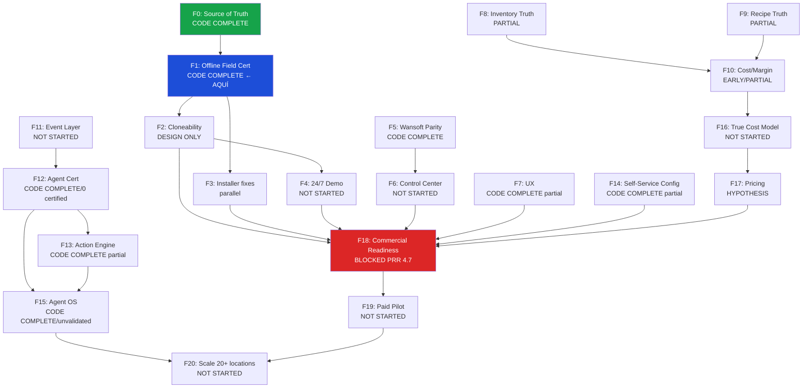

# FULLSITE MASTER EXECUTION PIPELINE

**v1.0-reconciled — 2026-08-05 | release head: faf546d (prev: 7cc59ec — preserved in release history)**
**PIPELINE STATUS: CANONICAL V1.0-RECONCILED — PRE-FIELD HARDENING COMPLETE — WAITING FOR MONDAY PHYSICAL DIAGNOSTIC**
**Clasificación:** Interno — Fundador / Equipo Técnico / Inversionista

> Este documento es la única fuente de verdad sobre en qué fase está Fullsite, qué la bloquea, y en qué orden se ejecuta el roadmap. No duplica ningún otro documento — los referencia.

---

## HONESTY RULES

Todo dato en este documento está clasificado como:

- **FACT** — evidencia directa en código, commits, o documentación con fecha
- **INFERENCE** — razonamiento a partir de evidencia indirecta
- **HYPOTHESIS** — supuesto sin evidencia suficiente para clasificar como hecho
- **UNKNOWN** — no existe evidencia suficiente para clasificar

Nunca se declara algo como "verificado en campo" sin evidencia de ejecución física.

---

## NORTH STAR

**Definición:** Fullsite es la capa operativa e inteligente para grupos restauranteros — entrega información al segundo, habilita decisiones en tiempo real y genera más revenue por sucursal.

**Diferenciación central:** No otro POS. La inteligencia de operación que ningún POS existente tiene.

**Cliente objetivo (hoy):** Grupos restauranteros de 2–20 sucursales en México que ya usan Wansoft y sienten el techo de su sistema.

**Métricas de éxito (a 12 meses):**
- ≥3 clientes de pago, contrato firmado, sistema en producción
- PRR ≥ 7/10 (hoy: 4.7)
- ORS ≥ 90/100 (hoy: 94/100 — PASS)
- ≥1 sucursal Fullsite-only, sin Wansoft paralelo
- ≥1 caso de ahorro o revenue documentado con número real

---

## EXECUTIVE DASHBOARD

| Indicador | Valor | Estado | Fuente | Clasificación |
|---|---|---|---|---|
| ORS (Offline Reliability Score) | 94 / 100 | HISTORICAL — pre-7cc59ec | RUNTIME-HEALTH.md · TSK-001 · 2026-08-04 | FACT — recompute post-field |
| PRR (Production Readiness Review) | 4.7 / 10 | HISTORICAL — pre-release | PRR-v1.md | FACT — recompute post-field |
| Tests passing — 5 suites | 2,506 | PASS · TSC CLEAN | AUTH 54 · LocalSrv 170 · Dash 2095 · Bridge+Sec 142 · Demo 45 | FACT |
| Agentes certificados | 0 | NO CERTIFICADO | AGENT-CERTIFICATION-REGISTRY.md | FACT |
| Agent count | RECONCILE FROM REGISTRY | — | AGENT-CERTIFICATION-REGISTRY.md | PENDING |
| Release head | faf546d | PRE-FIELD HARDENING COMPLETE · CI 31066343422 13/13 PASS | docs(field): INSTALLER-VERIFICATION.md delta · prev build 31033026398 | FACT |
| EXE canónico | Fullsite POS Setup 1.3.3.exe | 81,757,095 bytes · SHA-256 verified | release/offline-field-2026-08-06 · build 31033026398 | FACT |
| Clientes de pago | 0 | — | — | FACT |
| LOI Grupo Galería | FOUNDER-REPORTED | SIGNED ARTIFACT NOT LOCATED IN REPO · SIGNATURE VERIFICATION PENDING | GRUPO-GALERIA-NEXT-STEPS.md | FACT (reporte) · PENDING (verificación) |
| Fase actual del pipeline | F1 — Offline Field Preparation | CODE/LAB READY — FIELD VERIFICATION PENDING | release/offline-field-2026-08-06 | FACT |
| D-002 | APPROVED | Gate actual: T-01 Diagnostic Session | FOUNDER-INBOX | FACT |
| Gate actual | T-01 DIAGNOSTIC SESSION AMALAY | PDV3 → SERVER1 · 30-45 min · SIN instalación | — | FACT |
| OC-09 / OC-10 | CODE VERIFIED | Física pendiente post T-01 | OCS-P2.5.9 | FACT |
| Installer | 7/7 scripted · 4 PASS (LAB) | req 1,4,5 PASS · req 2,3,6,7 PASS (LAB) · CI 31066343422 · NOT FIELD VERIFIED | INSTALLER-VERIFICATION.md | FACT |
| Precio mensual | UNKNOWN | PAST HYPOTHESES: $1,999 y $4,999 — ninguna aprobada ni validada | PRICING.md | FACT |
| Producción | NOT DEPLOYED | Main UNCHANGED (e104e19) · DB NOT CHANGED | — | FACT |

> **D-003 ACTIVO — TRUE COST MODEL REQUIRED:** No existe precio aprobado para Fullsite. $1,999 (PRICING.md) y $4,999 (sesión previa) son PAST HYPOTHESES. Ningún número puede usarse externamente. D-003 requiere: implementation cost · migration cost · hardware cost · cloud cost · AI cost · support cost · field cost · gross margin target · package hypotheses · WTP interviews · paid pilot evidence.

---

## FASE ACTUAL

```
═══════════════════════════════════════════════════════════════
 FULLSITE está en:   F1 — OFFLINE FIELD PREPARATION
 Tarea técnica:      PRE-FIELD HARDENING COMPLETE
 Release head:       faf546d (prev: 7cc59ec — preserved in release history)
 EXE:                Fullsite POS Setup 1.3.3.exe (81,757,095 bytes)
 D-002:              APPROVED
 Visita AMALAY:      LUNES 2026-08-10
 Gate de campo:      T-01 DIAGNOSTIC SESSION
                     PDV3 → SERVER1 · 30–45 min · SIN instalación
 Salida T-01:        DEPLOYMENT TYPE · MIGRATION BRANCH · INSTALL AUTH/BLOCKED
 Field Kit USB:      FROZEN — COPIAR A USB ANTES DE LUNES
 Main:               UNCHANGED (e104e19)
 Production:         NOT DEPLOYED
 Pipeline:           PRE-FIELD HARDENING COMPLETE · WAITING FOR MONDAY PHYSICAL DIAGNOSTIC
═══════════════════════════════════════════════════════════════
```

**Pre-requisitos para T-01 Diagnostic Session:**
1. D-002 aprobado (DONE)
2. Fecha agendada con equipo AMALAY
3. Bridge corriendo (127.0.0.1:7717)
4. KDS activo en pantalla cocina
5. Impresora conectada
6. Al menos 2 terminales disponibles
7. Red de prueba disponible (para simular offline)
8. Credenciales de gerente PBKDF2 provisionadas
9. pos_manager_credentials_v2 poblado
10. Checklist OCS-P2.5.9 Fase A impreso
11. Cámara o pantalla de grabación disponible (evidencia)
12. Tiempo bloqueado: mínimo 2 horas

---

## CRITICAL PATH

Secuencia de field execution — reconciliada con release/offline-field-2026-08-06:

```
RELEASE PREP COMPLETE (faf546d · prev: 7cc59ec)
  → T-01 DIAGNOSTIC SESSION (30-45 min · SIN instalación)
  → INSTALLATION DECISION (Output de T-01)
  → CONTROLLED FIELD INSTALL
  → OFFLINE CERTIFICATION (OCS-P2.5.9 Fases A-D)
  → FIX / RETEST (si hay FAIL en campo)
  → CLONEABILITY FIELD PASS (second tenant en AMALAY)
  → CLEAN INSTALL (entorno limpio)
  → NO-FOUNDER INSTALL (alguien del equipo, sin Daniel)
  → DEMO 24/7 (F4 — not started)
  → DATA TRUTH (F8-F10 — partial)
  → MARGIN (F16 — not started)
  → AGENT CERTIFICATION (F12 — 0 certified)
  → ACTION (F13 — unvalidated)
  → COMMERCIAL PILOT (F19 — LOI only)
```

Workstreams paralelos (no bloquean el critical path):
- F3 Windows execution tests (backup, firewall)
- F0 deuda: Staff Login PBKDF2, DRIFT-RISK-001
- PRR findings resolution (F18 prep)
- D-003 True Cost Model (F17)

---

## DEPENDENCY DAG (Mermaid)



---

## PIPELINE: F0 → F20

### F0 — Source of Truth & Runtime Governance

| Campo | Valor |
|---|---|
| Estado | CODE COMPLETE |
| Evidencia | RUNTIME-HEALTH.md · RUNTIME-GAP-REGISTER.md · INV-05 gate activo |
| ORS | 94 / 100 PASS |
| Gaps abiertos | 0 (FACT) |
| Audit Findings pendientes | AF-001 (P2 known) · AF-005 |
| Gate de salida | ORS ≥ 80 con 0 P0 activos → ✅ |
| Habilita | Prerequisito de todas las fases |
| Clasificación | FACT |

**Módulos cubiertos:** Sync Queue (IDB) · Bridge WS · KDS → Bridge · Print Queue · command_id UUID v4 · Manager PIN PBKDF2 · Mesa state (LAN) · Print recovery (setInterval 60s) · Event log durability (P2 known risk)

**Deuda conocida:** Staff Login offline usa SHA-256 (no PBKDF2) — workstream independiente. DRIFT-RISK-001: ROLE_HIERARCHY duplicado client/server — sin parity test.

---

### F1 — Offline Field Preparation ← **FASE ACTUAL**

| Campo | Valor |
|---|---|
| Estado | CODE/LAB READY — FIELD VERIFICATION PENDING |
| Release | faf546d (release/offline-field-2026-08-06 · 39 commits ahead of main · prev: 7cc59ec) |
| Build | GHA 31033026398 (installer build) · GHA 31066343422 (hardening 13/13 PASS) |
| EXE canónico | Fullsite POS Setup 1.3.3.exe · 81,757,095 bytes · SHA-256: 7667032D…DC789D |
| Field Kit | COMPLETE |
| D-002 | APPROVED (FACT) |
| Gate actual | T-01 DIAGNOSTIC SESSION AMALAY — PDV3 primero, SERVER1 segundo, 30-45 min, SIN instalación |
| Salida T-01 | DEPLOYMENT TYPE · MIGRATION BRANCH · INSTALLATION AUTHORIZED / BLOCKED |
| Certificación (post-install) | OCS-P2.5.9 — 4 Fases: A (normal) · B (red caída) · C (reconexión) · D (multi-terminal) |
| Offline Test Matrix | 16 AUTOMATED VERIFIED · 1 LAB VERIFIED · 10 PHYSICAL FIELD PENDING |
| Criterios OCS-P2.5.9 | 12 PENDING PHYSICAL EXECUTION — no declarar FIELD VERIFIED antes de 2026-08-10 |
| Criterios code-verified | OC-09 (PBKDF2 + meetsMinRole) · OC-10 (command_id UUID) — código verificado, física pendiente |
| Tests auth | 54 / 54 PASS |
| Fix incluido | AUTH-OFFLINE-02 (GAP-A CLOSED) |
| Producción | NOT DEPLOYED · Main UNCHANGED (e104e19) · DB NOT CHANGED |
| Habilita | F2 inicio formal · R1-G02 verde (post-field) |
| Clasificación | FACT (código y release) · PENDING (field execution) |

**Ruta si FAIL en campo:** Detener caso → documentar síntoma → fix → tests → repetir físico. No avanzar F2 con OC-01..08 en FAIL.

---

### F2 — Cloneability / Golden Skeleton

| Campo | Valor |
|---|---|
| Estado | PARTIAL — CODE/LAB EVIDENCE · FIELD AND NO-FOUNDER PENDING |
| Second Tenant Seed | LAB VERIFIED |
| TI-01..TI-05 | PASS |
| AMALAY rows in demo tenant | 0 — VERIFIED |
| P0-7 Hardcode Leakage | FIXED / CLOSED |
| No-Founder Install | PENDING |
| Field Clone | PENDING |
| Spec D-01..D-34 | FROZEN (commits 1520577 + 6d50c45) |
| Scripts pendientes | provision_client.sh · verify_rls.py · check_hardcodes.sh · smoke test automation |
| Habilita | F18 (Commercial Readiness) cuando field + no-founder PASS |
| Clasificación | FACT (lab evidence) · PENDING (field + no-founder) |

---

### F3 — Fingerprint / Hardware / Installer

| Capacidad | Estado |
|---|---|
| NSIS INSTALL | LAB VERIFIED |
| NSIS UNINSTALL | LAB VERIFIED |
| CLEAN WINDOWS CI | PASS |
| ARTIFACT HASH | VERIFIED (SHA-256 7667032D…DC789D) |
| PRE-INSTALL-BACKUP.ps1 | WINDOWS LAB VERIFIED · CI 31066343422 steps 2+3 PASS |
| FIREWALL-SETUP.ps1 (7717 TCP + 5353 UDP) | WINDOWS LAB VERIFIED · CI 31066343422 steps 4+9 PASS |
| INSTALL.cmd | WINDOWS LAB VERIFIED · CI 31066343422 step 5b PASS · cosmetic: `call :log.` no-op blank lines (non-blocking) |
| ROLLBACK.ps1 | WINDOWS LAB VERIFIED · CI 31066343422 step 8 PASS · FIELD RETEST PENDING |

| Campo | Valor |
|---|---|
| EXE canónico | Fullsite POS Setup 1.3.3.exe · 81,757,095 bytes |
| Hardening CI | GHA 31066343422 · 13/13 STEPS PASS · WINDOWS LAB VERIFIED |
| No-mutation gate | DIAGNOSTIC-ONLY.ps1 + CERT-CAPTURE.ps1 provably read-only — events.ndjson byte-identical |
| Bloqueante para R2 | Field execution pending — R2-G03 (capacidades verificadas en Windows REAL, no CI runner) |
| Clasificación | FACT (CI evidence) · PENDING (field execution) |

---

### F4 — 24/7 Synthetic Demo

| Campo | Valor |
|---|---|
| Estado | NOT STARTED |
| Arquitectura | UNKNOWN — sin doc de diseño |
| Descripción | Entorno demo permanente con datos sintéticos reales · Accesible sin credenciales de producción |
| Habilita | Ventas self-service · Acceso a inversionistas · Demo sin AMALAY |
| Clasificación | HYPOTHESIS (necesaria, no diseñada) |

---

### F5 — Wansoft Parity

**Estado: PER-CAPABILITY — no clasificar como CODE COMPLETE de forma agregada.**

| Capacidad | Estado |
|---|---|
| Wansoft core parity | INFERENCE — audit post-implementación pendiente |
| POS UX | INFERENCE — sin audit formal por componente |
| Owner dashboard | INFERENCE |
| Fingerprint / device binding | UNKNOWN |
| Routing | UNKNOWN |
| Corte X | UNKNOWN |
| Z sequencing | UNKNOWN |
| Delivery | UNKNOWN |
| Workforce full parity | UNKNOWN |
| Inventory full parity | PARTIAL — 71.1% coverage catálogo |

| Campo | Valor |
|---|---|
| Bibles cerradas | 5 de 5 — diseño CLOSED |
| Features construidas | 17 páginas inventario · 574 recetas · encuestas · egresos · lealtad · cuentas · nómina |
| Paridad verificada | INFERENCE — no hay audit formal post-implementación por capacidad |
| Clasificación | FACT (features construidas) · INFERENCE/UNKNOWN (capacidades individuales) |

---

### F6 — Control Center (Multi-Client Management)

| Campo | Valor |
|---|---|
| Estado | NOT STARTED |
| Descripción | Panel central para gestionar múltiples sucursales · alertas · agentes · configuración |
| Habilita | Operación a escala · R3 (20+ clientes) |
| Clasificación | HYPOTHESIS |

---

### F7 — UX / Design System (HAILO)

**Estado: PARTIAL — per-component, no CODE COMPLETE de forma agregada.**

| Componente | Estado |
|---|---|
| HAILO dark mode | CODE COMPLETE |
| Sistema de tokens | CODE COMPLETE |
| POS UX por componente | UNVERIFIED sin audit individual |
| Landing premium | DESIGN ONLY |
| Owner dashboard UX | UNKNOWN |

| Campo | Valor |
|---|---|
| Clasificación | FACT (dark mode) · UNKNOWN (componentes sin audit individual) |

---

### F8 — Inventory Truth

| Campo | Valor |
|---|---|
| Estado | PARTIAL / CANONICAL COVERAGE INCOMPLETE |
| Páginas | 17 construidas |
| Recetas en BD | 574 |
| Problema de datos | 439/615 recetas con un solo ingrediente · 81 ghost ingredients · coverage 71.1% |
| Certified canonical | INCOMPLETE |
| Validación de campo | PENDING — datos de AMALAY no auditados formalmente |
| Habilita | F10 (quando canonical coverage completa) |
| Clasificación | FACT (estructura) · INFERENCE (calidad) · PARTIAL (cobertura) |

---

### F9 — Recipe Truth

| Campo | Valor |
|---|---|
| Estado | PARTIAL / CERTIFIED CANONICAL RECIPES INCOMPLETE |
| Fuente canónica | pos_recipes (Excel import) |
| Food cost | ~27.6% — FACT desde pos_recipes |
| Problema | wansoft_food_cost STALE · exactitud de recetas = INFERENCE sin audit |
| Certified canonical | INCOMPLETE |
| Habilita | F10 (cuando canonical completa) |
| Clasificación | FACT (estructura) · INFERENCE (exactitud) · PARTIAL |

---

### F10 — Cost / Margin Engine

| Campo | Valor |
|---|---|
| Estado | EARLY / PARTIAL |
| Food cost | ~27.6% — FACT desde pos_recipes |
| P&L | PARTIAL — labor cost, overhead, margen neto real MISSING |
| Motor completo | HYPOTHESIS — sin arquitectura de margen total |
| Habilita | F16 (True Cost Model) |
| Clasificación | FACT (food cost) · HYPOTHESIS (margen total) · PARTIAL |

---

### F11 — Event / Cross-Data Layer

| Campo | Valor |
|---|---|
| Estado | NOT STARTED |
| Descripción | Capa unificada de eventos que cruza POS · reservas · inventario · agentes |
| Habilita | F12 (Agent Certification con datos reales) |
| Clasificación | HYPOTHESIS |

---

### F12 — Agent Certification

| Campo | Valor |
|---|---|
| Estado | CODE COMPLETE (agentes construidos) · DESIGN ONLY (framework de certificación) |
| Agent count | RECONCILE FROM CURRENT REGISTRY — no usar número sin verificación actual |
| Agentes CERTIFICADOS | 0 (FACT — AGENT-CERTIFICATION-REGISTRY.md) |
| Framework | Agent Accuracy Program — DESIGN ONLY |
| Primer agente a certificar | anomaly_detector (requiere 30 días de labels) |
| Uso en comunicación | No usar conteo de agentes como indicador de readiness |
| Clasificación | FACT (código) · FACT (0 certificados) · PENDING (count reconciliation) |

> **Nota:** El número de agentes no es un indicador de readiness. Certificados = 0. No usar conteo de agentes en comunicación con clientes o inversionistas sin reconciliar desde AGENT-CERTIFICATION-REGISTRY.md actual.

---

### F13 — Action Engine

| Campo | Valor |
|---|---|
| Estado | CODE COMPLETE (básico) |
| Implementado | upselling_agent.py · close_predictor.py · kitchen_quality_agent.py |
| Validación | No validado con datos de producción — alertas generadas pero FP/FN desconocidos |
| Habilita | F15 (Agent OS) |
| Clasificación | FACT (código) · UNKNOWN (efectividad) |

---

### F14 — Self-Service Config

| Campo | Valor |
|---|---|
| Estado | CODE COMPLETE (backend) · NOT STARTED (UI) |
| Hecho | Tabla clients · multi-tenant config · client_slug |
| Pendiente | UI de onboarding self-service para nuevos clientes |
| Habilita | F18 (escala sin intervención manual) |
| Clasificación | FACT (backend) · NOT STARTED (UI self-service) |

---

### F15 — Autonomous / Agent OS

| Campo | Valor |
|---|---|
| Estado | CODE COMPLETE (infraestructura) |
| Hecho | War Room architecture · orquestador · 26 tentáculos · agent_runs table · agent_messages |
| No hecho | Validación de efectividad · certificación · feedback loop real |
| ORS contribution | +0 (no afecta ORS directamente) |
| Habilita | F20 (escala) |
| Clasificación | FACT (infraestructura) · UNKNOWN (valor real generado) |

---

### F16 — True Cost Model

| Campo | Valor |
|---|---|
| Estado | NOT STARTED |
| Descripción | Costo total por platillo incluyendo labor + overhead + food cost |
| Prerequisito | F10 (food cost) + datos de nómina reales |
| Clasificación | HYPOTHESIS |

---

### F17 — Pricing Strategy

| Campo | Valor |
|---|---|
| FULLSITE PRICE | UNKNOWN |
| Past hypotheses (no usar) | $1,999/mes (PRICING.md) · $4,999/mes (sesión previa) — ambas PAST HYPOTHESES |
| Validación de mercado | NO EXISTE — entrevistas cualitativas no son validación de mercado |
| Comparativa | Wansoft $2,800+IVA/mes (survey 2026-05) — referencia únicamente |
| D-003 requiere | Implementation cost · migration cost · hardware cost · cloud cost · AI cost · support cost · field cost · gross margin target · package hypotheses · WTP interviews · paid pilot evidence |
| Estado | UNKNOWN — no existe precio aprobado por fundador |
| Clasificación | UNKNOWN (precio) · FACT (que no existe precio validado) |

---

### F18 — Commercial Readiness

| Campo | Valor |
|---|---|
| Estado | BLOCKED |
| PRR score | 4.7 / 10 — NOT CERTIFIED para Cliente #2 |
| PRR findings abiertos | PRR-01 · PRR-03 · PRR-05 · PRR-06 · PRR-07 |
| PRR findings cerrados | PRR-02 (sync retry, dacf364) · PRR-04 (printer recovery, 80a8d7d) |
| Installer | 3 / 7 PASS — BLOCKER |
| Gate numérico | PRR ≥ 7/10 + Installer ≥ 6/7 |
| Habilita | F19 (Paid Pilot) |
| Clasificación | FACT |

---

### F19 — External Paid Pilot

| Campo | Valor |
|---|---|
| Estado | NOT STARTED |
| LOI Status | FOUNDER-REPORTED SIGNED LOI |
| Signed artifact en repo | NOT LOCATED |
| Signature verification | PENDING |
| Onboarding candidate | Grupo Galería (Dunkin', BWW, Carl's Jr., IHOP) |
| Contacto | Marcelo Gracia (COO Grupo Galería) |
| Revenue | 0 |
| Active contract | NO VERIFIED EVIDENCE |
| Siguiente paso | Operational Assessment (D-004) |
| Bloqueado por | F18 (PRR ≥ 7 + installer caps en Windows real) |
| Clasificación | FACT (founder report) · PENDING (verification) · NOT STARTED (pilot) |

---

### F20 — Multi-Location Scale (20+ sucursales)

| Campo | Valor |
|---|---|
| Estado | NOT STARTED |
| Prerequisito | F19 completo · Control Center (F6) · Agent OS validado (F15) |
| Clasificación | HYPOTHESIS |

---

## CAPABILITY MATRIX

| Capacidad | Estado | Evidencia | Clasificación |
|---|---|---|---|
| POS offline básico | CODE COMPLETE | ORS 94/100 | FACT |
| Manager PIN PBKDF2 | CODE COMPLETE | commit c2e4770 · 54 tests | FACT |
| Role hierarchy offline | CODE COMPLETE | AUTH-OFFLINE-02 fix · GAP-A closed | FACT |
| Bridge LAN sync | CODE COMPLETE | RAF-001..005 | FACT |
| KDS offline | CODE COMPLETE | useBridgeClient('kds') | FACT |
| Impresión con recovery | CODE COMPLETE | setInterval 60s · RAF-008 | FACT |
| Multi-tenant config | CODE COMPLETE | clients table · client_slug | FACT |
| Inventario 17 páginas | PARTIAL — CANONICAL COVERAGE INCOMPLETE | 17 páginas + 574 recetas · canonical cobertura incompleta | FACT |
| Food cost ~27.6% | PARTIAL — CERTIFIED CANONICAL RECIPES INCOMPLETE | pos_recipes · recetas certificadas incompletas | FACT |
| Agentes War Room | CODE COMPLETE — COUNT: RECONCILE FROM REGISTRY | Telegram activo · 0 CERTIFIED | FACT |
| HAILO dark mode | CODE COMPLETE | commits documentados | FACT |
| Wansoft parity core | CODE COMPLETE | 5 bibles + implementación | FACT |
| Golden Skeleton D-01..34 | DESIGN ONLY | spec frozen | FACT |
| Installer completo | PARTIAL — PER CAPACIDAD | NSIS LAB VERIFIED · Win scripts CODE COMPLETE/PENDING | FACT |
| Agentes certificados | BLOCKED | 0/26 | FACT |
| Self-service onboarding | NOT STARTED | — | FACT |
| Control Center multi-sucursal | NOT STARTED | — | FACT |
| Staff Login PBKDF2 | NOT STARTED | SHA-256 deuda | FACT |
| True Cost Model (labor+overhead) | NOT STARTED | — | FACT |
| Demo 24/7 sintético | NOT STARTED | — | HYPOTHESIS |
| Precio aprobado por fundador | NOT STARTED | contradicción activa | FACT |

---

## PARALLEL WORKSTREAMS

Estos tracks pueden avanzar simultáneamente sin depender de F1 FIELD:

| Track | Fase | Responsable | Bloqueante |
|---|---|---|---|
| Installer fixes (backup, firewall, NSIS logs) | F3 | Eng | — |
| Staff Login PBKDF2 upgrade | F0/deuda | Eng | — |
| DRIFT-RISK-001: ROLE_HIERARCHY parity test | F0/deuda | Eng | — |
| Agent Accuracy labeling (anomaly_detector) | F12 | Eng | 30 días datos |
| PRR findings resolución (PRR-01, 03, 05..07) | F18 | Eng | — |
| Operational Assessment Grupo Galería | F19 prep | Daniel | D-002 primer |
| Eduardo de la Garza — contrato | Hiring | Daniel | — |
| Pricing — decisión fundador | F17 | Daniel | — |

---

## BLOQUEADO / NO CONSTRUIR TODAVÍA

Capacidades que están explícitamente fuera del scope actual:

| Capacidad | Razón | Desbloquea cuando |
|---|---|---|
| WhatsApp Business API inbound | Meta Business Manager auth pendiente | F18 completo |
| Google Cloud OAuth (GBP reviews) | 5 pasos de OAuth pendientes | F18 completo |
| Multi-Location Control Center | Requiere F6 diseñado | F18 completo |
| Nuevos agentes War Room | AI Ops v1 feature complete — sin nuevos por iniciativa propia | Evidencia de FP/FN observado |
| Facturación PAC (Facturapi CFDI) | CSD pendiente · RFC FULLSITE SAS pendiente | RFC + CSD obtenidos |
| iOS Capacitor app | No en critical path | F19 (pilot) |
| CFDI 4.0 desde POS | Facturapi+CSD bloqueados | RFC + CSD |
| Split multi-persona | P2 — no en critical path | F2 completo |
| Eduardo Esquivel equity (4%) | Contrato enviado 2026-06-10 · status UNKNOWN | Confirmación firma |

---

## FOUNDER DECISION INBOX

| ID | Decisión | Urgencia | Habilita | Status |
|---|---|---|---|---|
| **D-002** | VISITA DE CERTIFICACIÓN — T-01 Diagnostic + OCS-P2.5.9 en AMALAY | — | F1 FIELD · R1-G02 · F2 start | **APPROVED** |
| **D-003** | TRUE COST MODEL + PRICING VALIDATION (PRICE = UNKNOWN) | ALTA | F17 · comunicación externa | PENDIENTE |
| **D-004** | GRUPO GALERÍA: Agendar Operational Assessment con Marcelo Gracia (COO) | ALTA | F19 prep | PENDIENTE |
| **D-005** | EDUARDO DE LA GARZA: RELATIONSHIP STATUS FOUNDER-REPORTED · CONTRACT STATUS UNKNOWN · ROLE/PERFORMANCE CLAIMS NOT VERIFIED IN CURRENT REPOSITORY | — | Hiring track | DEFERRED |
| **D-006** | FULLSITE SAS: ¿RFC e.firma obtenidos? ¿CSD en trámite? | MEDIA | Facturación | UNKNOWN |

**D-002 APPROVED.** Gate actual: Physical Access / Visit Coordination. T-01 Diagnostic Session: PDV3 primero → SERVER1 (30–45 min, SIN instalación). Salida: DEPLOYMENT TYPE · MIGRATION BRANCH · INSTALLATION AUTHORIZED/BLOCKED.

**D-003 ACTIVO.** FULLSITE PRICE = UNKNOWN. Past hypotheses ($1,999 y $4,999) no pueden usarse externamente. Requiere: true cost model completo + WTP interviews + paid pilot evidence antes de fijar cualquier precio.

---

## TOP 20 TAREAS

Reconciliadas con release/offline-field-2026-08-06 head faf546d (prev: 7cc59ec):

| # | Tarea | Fase | Owner | Estado | Estimado |
|---|---|---|---|---|---|
| T-01 | Copiar Field Kit USB: FULLSITE-FIELD-KIT/ + FULLSITE-DIAGNOSTIC/ · Visita AMALAY: 2026-08-10 | F1 | Daniel | FIELD KIT FROZEN — COPIAR A USB | — |
| T-02 | T-01 Diagnostic Session (PDV3 → SERVER1, 30-45 min, SIN instalación) | F1 | Eng+Daniel | NEXT PHYSICAL TASK — 2026-08-10 | 30-45 min |
| T-03 | T-02 Install si autorizado → T-03 OCS-P2.5.9 Fases A–D (12 criterios físicos) | F1 | Eng+Daniel | BLOCKED → T-01 DIAGNOSTIC + INSTALL AUTH | ~90-120 min |
| T-04 | PRE-INSTALL-BACKUP.ps1 — Windows execution test | F3 | Eng | WINDOWS LAB VERIFIED · CI 31066343422 | — |
| T-05 | FIREWALL-SETUP.ps1 (7717 TCP + 5353 UDP) — Windows test | F3 | Eng | WINDOWS LAB VERIFIED · CI 31066343422 | — |
| T-06 | ROLLBACK.ps1 — field retest | F3 | Eng | WINDOWS LAB VERIFIED · FIELD RETEST PENDING | — |
| T-07 | F2 No-Founder Install (sin Daniel) | F2 | Eng | PENDING AFTER FIELD | 1 día |
| T-08 | Build verify_rls.py (CI gate multi-tenant) | F2 | Eng | NOT STARTED | 1 día |
| T-09 | Build check_hardcodes.sh CI gate | F2 | Eng | NOT STARTED | 0.5 días |
| T-10 | Smoke test automation nuevo tenant (10 checks post-provision) | F2 | Eng | NOT STARTED | 2 días |
| T-11 | Staff Login offline: SHA-256 → PBKDF2 | F0/deuda | Eng | NOT STARTED | 2 días |
| T-12 | DRIFT-RISK-001: ROLE_HIERARCHY parity test client/server | F0/deuda | Eng | NOT STARTED | 0.5 días |
| T-13 | Agent Accuracy: label 30 días anomaly_detector | F12 | Eng | NOT STARTED | 30 días |
| T-14 | PRR-01 · PRR-03 · PRR-05 · PRR-06 · PRR-07 — resolution plan | F18 | Eng | 5 OPEN | TBD |
| T-15 | D-003 True Cost Model + Pricing Validation (PRICE = UNKNOWN) | F17 | Daniel | FUNDADOR | Weeks |
| T-16 | D-004 Grupo Galería: Operational Assessment (Marcelo Gracia) | F19 prep | Daniel | FUNDADOR | 1 semana |
| T-17 | F4 Synthetic Demo — architecture doc | F4 | Eng | NOT STARTED | 1 día |
| T-18 | TSK-002 HTTP contract tests — estado NO reconciliado con 7cc59ec | F15 | Eng | PENDING RECONCILIATION | — |
| T-19 | TSK-003 Logging persistente — estado NO reconciliado con 7cc59ec | F15 | Eng | PENDING RECONCILIATION | — |
| T-20 | P0-7 Hardcode Leakage | F2 | — | CLOSED | — |

---

## ROADMAP OFICIAL (SECUENCIA)

```
AHORA:     F1 field → (paralelo: F3 fixes, F0 deuda, F12 labeling, PRR findings)
SIGUIENTE: F2 Golden Skeleton → F14 self-service config
DESPUÉS:   F5 audit post-implementación → F4 demo → F6 Control Center
LUEGO:     F8/F9/F10 data quality → F16 true cost → F17 pricing decision
ENTONCES:  F18 Commercial Ready → F19 Paid Pilot (Grupo Galería)
ESCALA:    F20 Multi-location
```

Señalar desviaciones de esta secuencia antes de implementar cualquier cosa nueva.

---

## EVIDENCE APPENDIX

| Documento | Ruta | Propósito |
|---|---|---|
| Runtime Health | docs/runtime/RUNTIME-HEALTH.md | ORS, módulos, deuda |
| Runtime Gap Register | docs/runtime/RUNTIME-GAP-REGISTER.md | Gaps históricos + cerrados |
| Offline Suite | docs/certifications/OFFLINE-SUITE-v1.md | OC-01..12 criterios |
| OCS-P2.5.9 | docs/certifications/OCS-P2.5.9-OFFLINE-SYNC.md | Plan de certificación física |
| PRR v1 | docs/certifications/PRR-v1.md | Score 4.7/10 · 27 findings |
| Installer Verification | docs/agent-os/field/INSTALLER-VERIFICATION.md | 7/7 scripted · req 1,4,5 PASS · req 2,3,6,7 PASS (LAB) · CI 31066343422 |
| Offline Test Matrix | docs/agent-os/field/OFFLINE-TEST-MATRIX.md | 16 AUTOMATED · 1 LAB · 10 PHYSICAL PENDING |
| Readiness Contract | docs/agent-os/FULLSITE-READINESS-CONTRACT.md | R1/R2/R3/R4 gates |
| Agent Certification Registry | docs/ai/AGENT-CERTIFICATION-REGISTRY.md | 0/26 certified |
| P1 Golden Skeleton | docs/state/P1-GOLDEN-SKELETON.md | D-01..34 spec |
| Pricing | docs/strategy/PRICING.md | $1,999 hypothesis |
| Grupo Galería | docs/gtm/GRUPO-GALERIA-NEXT-STEPS.md | LOI details |
| Founder Inbox | docs/agent-os/FOUNDER-INBOX.md | Decisiones pendientes |
| HARDCODE Registry | docs/HARDCODE-REGISTRY.md | HC-01..03 closed · P2/P3 open |

---

*Actualizado: 2026-08-05 | Visita AMALAY: 2026-08-10*
*Delta update: faf546d — PRE-FIELD HARDENING COMPLETE · CI 31066343422 13/13 PASS · prev head 7cc59ec preserved en release history.*
*No declarar FIELD VERIFIED / OFFLINE CERTIFIED / PRODUCTION READY hasta después de ejecución física 2026-08-10.*
*No modificar fases, estados, o datos de evidencia sin fuente verificable.*
